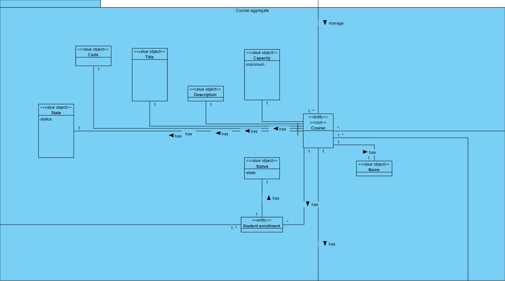
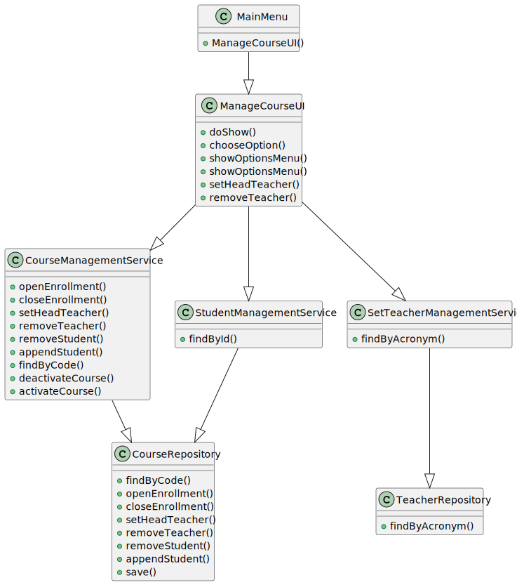

# US 1003

## 1. Context

The objective is to provide users with the capability to create courses. The successful implementation of this task will enable users to define and organize educational offerings according to their specific requirements.

## 2. Requirements

**US_1003** As User, I want to create a Course

## 3. Analysis

### 3.1 Domain Excerpt


## 4. Design

### 4.1. Sequence Diagram


### 4.2. Class Diagram



### 4.3. Applied Patterns
The applied patterns are:
- Service;
- Controller;
- Repository;
- Domain.

### 4.4. Tests
**Test1** *Verifies that a Course Getters return expected values*
```
    @Test
    public void ensureCourseGettersReturnExpectedValues() {
        Code code = new Code("C001");
        Name name = new Name("Dummy Course");
        Capacity capacity = new Capacity(20);
        Description description = new Description("This is a dummy course for testing purposes.");
        Title title = new Title("Dummy Course Title");
        State state = State.ACTIVE;
        Course course = new Course(code, name, capacity, description, title, state);
        assertEquals(code, course.getCode());
        assertEquals(name, course.getName());
        assertEquals(capacity, course.getCapacity());
        assertEquals(description, course.getDescription());
        assertEquals(title, course.getTitle());
        assertEquals(state, course.getState());
    }
```
**Test2** *Verifies that the enrollment is correctly changed*
```
    @Test
    public void ensureOCEnrollments(){
        Course course= createDummyCourse1();
        course.closeEnrollment();
        assertFalse(course.isEnrollementstate());
        course.openEnrollment();
        assertTrue(course.isEnrollementstate());
    }
```
**Test3** *Verify that two different Courses are indeed diferent*
```
    @Test
    public void ensureCoursesAreDifferent() {
        Course course1 = createDummyCourse1();
        Course course2 =createDummyCourse2();
        assertFalse(course1.equals(course2));
        assertNotSame(course1, course2);
        assertNotEquals(course1.getCode(), course2.getCode());
    }
```

There are also tests for all the valueobjects (Code ,Name ,Capacity ,Description ,Title ,State ), regarding their sets and gets.

## 5. Implementation

## CourseManagementController.java
```
    public class CourseManagementController extends  ListCourseController{
    private final CourseManagementService courseManagementService = new CourseManagementService();

    public Iterable<Course> findAllActive() {
        return courseManagementService.findAllActive();
    }
    public Iterable<Course> findAllInactive() {
        return courseManagementService.findAllInactive();
    }

    public Iterable<Course> findAll() {
        return courseManagementService.findAll();
    }

    public Course findByCode(String code) {
        return courseManagementService.findByCode(code);
    }

    public void appendStudent (List<Student> student, Course course){courseManagementService.appendStudent(student, course);}
}
```
## CourseManagementService.java
```
    public class CourseManagementService{
    CourseRepository courseRepository = PersistenceContext.repositories().Course();
    ListCourseController listCourseController = new ListCourseController();
    public Iterable<Course> findAllActive() {
        return courseRepository.findAllActive();
    }
    public Iterable<Course> findAllInactive() {
        return courseRepository.findAllInactive();
    }
    public Iterable<Course> findEnrollStateCourses(long MechanographicNumber){
        return courseRepository.findEnrollStateCourses (MechanographicNumber);
    }
    public Iterable<Course> findTeachingCourses (String acronym){
        return courseRepository.findTeachingCourses(acronym);
    }

    public Iterable<Course> findAll() {
        return listCourseController.listCourses();
    }

    public void deactivateCourse (Course course){
        courseRepository.deactivateCourse(course);
    }

    public void activateCourse (Course course){
        courseRepository.activateCourse(course);
    }


    public Course findByCode(String code) {
        return courseRepository.findByCode(code);
    }

    public void appendTeacher(Teacher teacher, Course course){
        courseRepository.appendTeacher(teacher, course);
    }
    public void appendStudent(List<Student> students, Course course){
        courseRepository.appendStudent(students, course);
    }
    public void removeTeacher(Teacher teacher, Course course){
        courseRepository.removeTeacher(teacher, course);
    }

    public void removeStudent(Student student, Course course){
        courseRepository.removeStudent(student, course);
    }

    public void setHeadTeacher(Teacher teacher, Course course){
        courseRepository.setHeadTeacher(teacher, course);
    }

    public void openEnrollment(Course course) {

    }
    public void closeEnrollment(Course course) {
    }
}

```
## Code.java
```
public class Code implements ValueObject, Comparable<Code> {

    private String valuecode;

    public Code(String valuecode) {
        this.valuecode = valuecode;
    }

    protected Code() {
    }

    public String getValue() {
        return valuecode;
    }

    public void setValueCode(String valuecode){
        this.valuecode = valuecode;
    }

    @Override
    public int compareTo(Code o) {
        return 0;
    }

    @Override
    public String toString() {
        return valuecode;
    }

    @Override
    public boolean equals(Object o) {
        if (this == o) return true;
        if (!(o instanceof Code)) return false;
        Code code = (Code) o;
        return valuecode.equals(code.valuecode);
    }

    @Override
    public int hashCode() {
        return Objects.hash(valuecode);
    }
}
```


## 6. Integration/Demonstration


## 7. Observations

