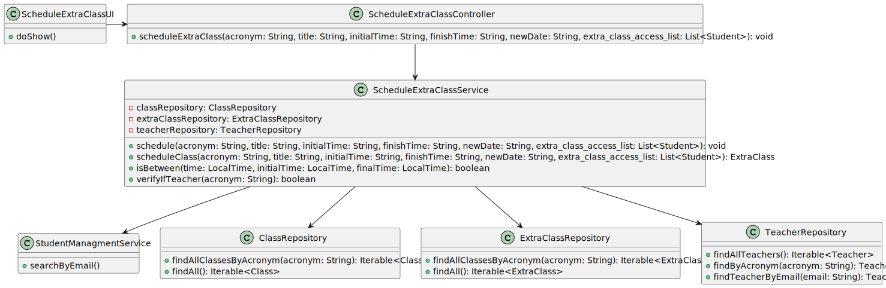

# US 1011

## 1. Context

It involves scheduling an extraordinary class, which refers to a class that is scheduled outside the regular class schedule. The purpose of scheduling an extraordinary class could be to cover additional topics, provide remedial sessions, or accommodate special events or circumstances. The ability to schedule such classes efficiently is crucial for teachers to effectively manage their curriculum and provide a comprehensive learning experience for students.

## 2. Requirements

**US_1011** As Teacher, I want to schedule an extraordinary class

## 3. Analysis

### 3.1 Domain Excerpt

## 4. Design

### 4.1. Sequence Diagram


### 4.2. Class Diagram



### 4.3. Applied Patterns
The applied patterns are:
- Service;
- Controller;
- Builder;
- Repository;
- Domain.

### 4.4. Tests
**Test1** *Verifies that a Class is created*
```
    @Test
    void ensureClassIsCreated(){
        ExtraClassBuilder build = new ExtraClassBuilder();
        List<Student> list = new ArrayList<Student>();
        build.with("EAPLI","12:30","13:30","2002-01-01",repo.findByAcronym("TTT"),list);
        ExtraClass ExtraClass = build.build();
        assertNotNull(ExtraClass);
    }
```

There are also tests for all the valueobjects regarding their sets and gets.
```
    @Test
    void getDuration() {
        ExtraClassBuilder build = new ExtraClassBuilder();
        List<Student> list = new ArrayList<Student>();
        build.with("EAPLI","12:30","13:30","2002-01-01",repo.findByAcronym("TTT"),list);
        ExtraClass ExtraClass = build.build();
        LocalTime initial = LocalTime.parse("12:30");
        LocalTime finish = LocalTime.parse("13:30");
        assertEquals(ExtraClass.getDuration().getInitialTime(),initial);
        assertEquals(ExtraClass.getDuration().getFinishTime(),finish);
    }

    @Test
    void getTitle() {
        ExtraClassBuilder build = new ExtraClassBuilder();
        List<Student> list = new ArrayList<Student>();
        build.with("EAPLI","12:30","13:30","2002-01-01",repo.findByAcronym("TTT"),list);
        ExtraClass ExtraClass = build.build();
        assertEquals(ExtraClass.getTitle().getTitle(),"EAPLI");
    }

    @Test
    void setDuration() {
        ExtraClassBuilder build = new ExtraClassBuilder();
        List<Student> list = new ArrayList<Student>();
        build.with("EAPLI","12:30","13:30","2002-01-01",repo.findByAcronym("TTT"),list);
        ExtraClass ExtraClass = build.build();
        ExtraClass.setDuration(new Duration(LocalTime.parse("14:30"),LocalTime.parse("16:30")));
        Duration expected = new Duration(LocalTime.parse("14:30"),LocalTime.parse("16:30"));
        assertEquals(ExtraClass.getDuration().getInitialTime(),expected.getInitialTime());
        assertEquals(ExtraClass.getDuration().getFinishTime(),expected.getFinishTime());
    }
```

## 5. Implementation

## ScheduleExtraClassController.java
```
public class ScheduleExtraClassController {
    private final AuthorizationService authz = AuthzRegistry.authorizationService();
    private final ScheduleExtraClassService svc = new ScheduleExtraClassService();

    public void scheduleExtraClass(String acronym, String title, String initialTime, String finishTime, String newdate, List<Student> extra_class_access_list) {
        authz.ensureAuthenticatedUserHasAnyOf(BaseRoles.TEACHER);
        svc.schedule(acronym,title,initialTime,finishTime,newdate,extra_class_access_list);
        }

}
```
## ScheduleExtraClassService.java
```
    public class ScheduleExtraClassService {

    private final ClassRepository classRepository = PersistenceContext.repositories().classes();
    private final ExtraClassRepository extraClassRepository = PersistenceContext.repositories().extraclasses();
    private final TeacherRepository teacherRepository = PersistenceContext.repositories().teachers();

    public void schedule(String acronym, String title, String initialTime, String finishTime,String newdate,List<Student> extra_class_access_list){
        if (verifyIfTeacher(acronym)) {
            LocalTime time1 = LocalTime.parse(initialTime);
            LocalTime time2 = LocalTime.parse(finishTime);
            for (Class classes : classRepository.findAllClassesByAcronym(acronym)) {
                boolean initialT = isBetween(time1, classes.getDuration().getInitialTime(), classes.getDuration().getFinishTime());
                boolean finalT = isBetween(time2, classes.getDuration().getInitialTime(), classes.getDuration().getFinishTime());
                if (newdate.equals(classes.getDayoftheweek().getDayoftheweek())) {
                    if (initialT == false && finalT == false) {
                        scheduleClass(acronym, title, initialTime, finishTime, newdate,extra_class_access_list);
                    }
                    break;
                } else {
                    scheduleClass(acronym, title, initialTime, finishTime, newdate,extra_class_access_list);
                }
            }
        }else {
            scheduleClass(acronym,title,initialTime,finishTime,newdate,extra_class_access_list);
        }
    }

    public ExtraClass scheduleClass(String acronym, String title, String initialTime, String finishTime, String newdate, List<Student> extra_class_access_list){
        final ExtraClassBuilder builder = new ExtraClassBuilder();
        builder.with(title,initialTime,finishTime,newdate,teacherRepository.findByAcronym(acronym),extra_class_access_list);
        final var newExtraClass = builder.build();
        return extraClassRepository.save(newExtraClass);
    }

    public static boolean isBetween(LocalTime time, LocalTime initialTime, LocalTime finalTime) {
        boolean isInBetween = false;
        if (finalTime.isAfter(initialTime)) {
            if (initialTime.isBefore(time) && finalTime.isAfter(time)) {
                isInBetween = true;
            }
        } else if (time.isAfter(initialTime) || time.isBefore(finalTime)) {
            isInBetween = true;
        }
        return isInBetween;
    }

    public boolean verifyIfTeacher(String acronym){
        List<ExtraClass> result = StreamSupport.stream(extraClassRepository.findAllClassesByAcronym(acronym).spliterator(), false).collect(Collectors.toList());
        if (result.size() != 0){
            return true;
        }
        return false;
    }

```
## ExtraClassBuilder.java
```
public class ExtraClassBuilder implements DomainFactory<ExtraClass> {

    private Title title;

    private Duration duration;
    private Date date;

    private Teacher teacher;

    private List<Student> Extra_class_access_list;

    public ExtraClassBuilder with(final String title, final String initialTime, final String finishTime, final String date, Teacher teacher, List<Student> Extra_class_access_list) {
        withStudents(Extra_class_access_list);
        withTitle(title);
        withDuration(initialTime,finishTime);
        withDate(date);
        withTeacher(teacher);
        return this;
    }

    private void withStudents(List<Student> extra_class_access_list) {
        this.Extra_class_access_list = extra_class_access_list;
    }

    public ExtraClassBuilder withTitle(final String title) {
        this.title = Title.valueOf(title);
        return this;
    }

    public ExtraClassBuilder withDuration(final String initialTime, final String finishTime) {
        this.duration = new Duration(LocalTime.parse(initialTime),LocalTime.parse(finishTime));
        return this;
    }

    public ExtraClassBuilder withDate(final String date) {
        this.date = new Date(date);
        return this;
    }

    public ExtraClassBuilder withTeacher(final Teacher teacher) {
        this.teacher = teacher;
        return this;
    }

    @Override
    public ExtraClass build() {
        // since the factory knows that all the parts are needed it could throw
        // an exception. however, we will leave that to the constructor
        ExtraClass classe;

        classe = new ExtraClass(title,duration,teacher,date,Extra_class_access_list);

        return classe;
    }
}
```
## ExtraClass.java
```
public class ExtraClass implements AggregateRoot<Long> {
@Id
@GeneratedValue (strategy = GenerationType.IDENTITY)
private Long extraclassid;
Date date;
@Embedded
private Title title;

    @Embedded
    private Duration duration;
    @ManyToOne
    private Teacher teacher;
    @OneToMany
    List<Student> Extra_class_access_list;
    public ExtraClass(Title title, Duration duration, Teacher teacher,Date date,List<Student> Extra_class_access_list) {
        this.title = title;
        this.duration = duration;
        this.date=date;
        this.teacher = teacher;
        this.Extra_class_access_list=Extra_class_access_list;
    }

    public ExtraClass() {}

    @Override
    public String toString() {
        StringBuilder sb = new StringBuilder();
        sb.append("Class ID: ").append(extraclassid).append("\n");
        sb.append("Title: ").append(title.getTitle()).append("\n");
        sb.append("Start Time: ").append(duration.getInitialTime()).append("\n");
        sb.append("End Time: ").append(duration.getFinishTime()).append("\n");
        sb.append("Duration: ").append(duration.getDurationValue()).append("\n");
        sb.append("Teacher: ").append(teacher != null ? teacher.getUser().name() : "N/A").append("\n");
        return sb.toString();
    }

    @Override
    public boolean sameAs(Object other) {
        return false;
    }

    @Override
    public Long identity() {
        return null;
    }

    public Duration getDuration() {
        return duration;
    }


    public Title getTitle() {
        return title;
    }

    public void setDuration(Duration duration) {
        this.duration = duration;
    }
}
```
## ExtraClassRepository.java
```
public interface ExtraClassRepository extends DomainRepository<Long, ExtraClass> {

    Iterable<ExtraClass> findAllClassesByAcronym(String acronym);
    Iterable<ExtraClass> findAll();
}
```

## 6. Integration/Demonstration


## 7. Observations

