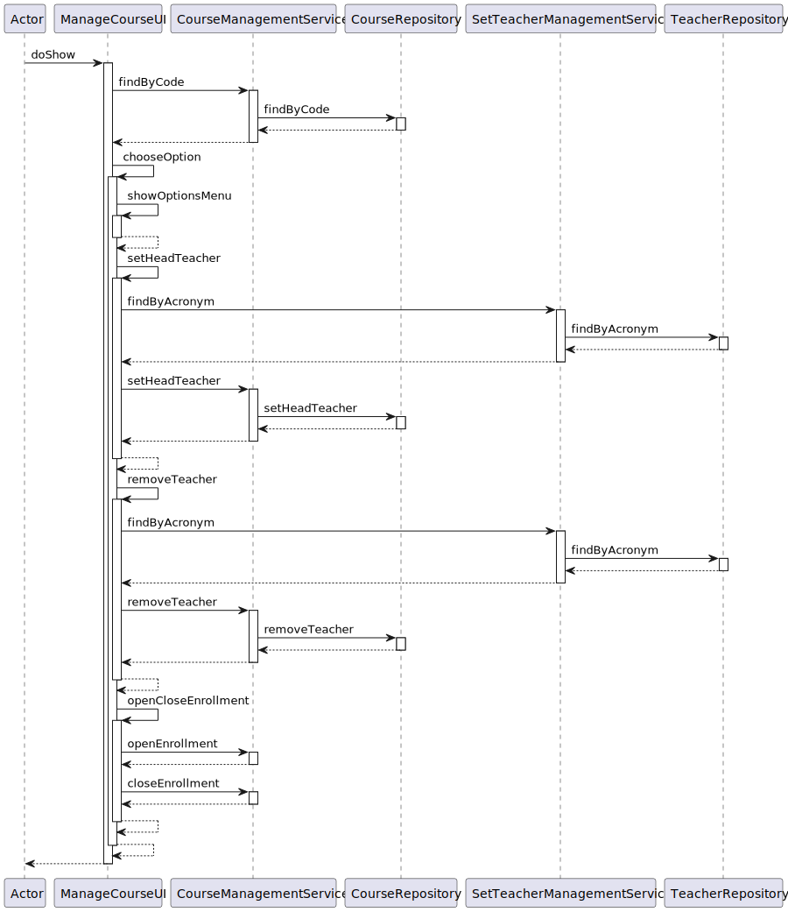

# US 2001

## 1. Context

Exams are an integral part of assessing students' knowledge and understanding in an educational environment. Teachers are responsible for defining the exam details, such as the date, title, course, sequence of sections, and header information. They can also select questions from a question pool to include in the exam. The ability to update exams enables teachers to make adjustments and modifications as needed, ensuring the relevance and effectiveness of the assessment.
## 2. Requirements

**US_2001** As Teacher, I want to create/update an exam

## 3. Analysis

### 3.1 Domain Excerpt

## 4. Design

### 4.1. Sequence Diagram



### 4.2. Class Diagram


### 4.3. Applied Patterns
The applied patterns are:
- Service;
- Controller;
- Repository;
- Domain.

### 4.4. Tests
**Test1** *Verifies that a Exam getters return expected values*
```
    @Test
    public void ensureExamGettersReturnExpectedValues() {
        List<Question> questions = new ArrayList<>();
        Date date = new Date();
        Description description = new Description("This is an exam");
        SequenceofSections sequenceofSections = new SequenceofSections("This is description");
        eapli.base.exammanagement.domain.Title title = new eapli.base.exammanagement.domain.Title("Examtest");
        Header header = new Header(description, Header.Feedback.NONE, Header.Grade.NONE, "Dummy 1 Global Setting");
        Course course = createDummyCourse1();
        Exam exam = new Exam(questions, date, sequenceofSections, title, course,header);

        assertEquals(date, exam.getDate());
        assertEquals(header, exam.getHeader());
        assertEquals(sequenceofSections, exam.getSequenceofSections());
        assertEquals(title, exam.getTitle());
        assertEquals(course, exam.getCourse());
    }
```
**Test1** *Verifies that a Exam getters return expected values*
```
    @Test
    public void ensureExamGettersReturnExpectedValues() {
        List<Question> questions = new ArrayList<>();
        Date date = new Date();
        Description description = new Description("This is an exam");
        SequenceofSections sequenceofSections = new SequenceofSections("This is description");
        eapli.base.exammanagement.domain.Title title = new eapli.base.exammanagement.domain.Title("Examtest");
        Header header = new Header(description, Header.Feedback.NONE, Header.Grade.NONE, "Dummy 1 Global Setting");
        Course course = createDummyCourse1();
        Exam exam = new Exam(questions, date, sequenceofSections, title, course,header);

        assertEquals(date, exam.getDate());
        assertEquals(header, exam.getHeader());
        assertEquals(sequenceofSections, exam.getSequenceofSections());
        assertEquals(title, exam.getTitle());
        assertEquals(course, exam.getCourse());
    }
```
**Test2** *Verifies that two Exams are different*
```
     @Test
    public void ensureExamsAreDifferent() {
        Exam exam1 = createDummyExam1();
        Exam exam2 = createDummyExam2();

        assertNotEquals(exam1, exam2);
        assertNotEquals(exam1.hashCode(), exam2.hashCode());
    }
```
There are also tests for all the valueobjects regarding their sets and gets.


## 5. Implementation

## CreateExamController.java
```
public class CreateExamController {
    ExamRepository examRepository = PersistenceContext.repositories().exams();
    CourseRepository courseRepository = PersistenceContext.repositories().Course();
    QuestionRepository questionRepository = PersistenceContext.repositories().questions();

    public void createExam(String course,List<Question> qt,Date dt, SequenceofSections ss, Title title,Header header) {
        Exam newExam = new Exam(qt, dt, ss, title, courseRepository.findByCode(course),header);
        examRepository.save(newExam);
    }

    public Iterable<Exam> listExams() {
        return examRepository.findAll();
    }

    public Iterable<Question> getrandomquestion() {
       return questionRepository.findAll();
    }
}
```
## ExamManagementService.java
```
   public class ExamManagementService {
    ExamRepository examRepository = PersistenceContext.repositories().exams();
    CreateExamController createExamController = new CreateExamController();


    public Iterable<Exam> findAll() {
        return examRepository.findAll();
    }


    public Exam findByCode(String code) {
        return examRepository.findByCode(code);
    }

    public void appendStudent(Student student, Exam ExamCode){
        examRepository.appendStudent(student, ExamCode);
    }
}
```
## Exam.java
```
public class Exam implements AggregateRoot<Code> {

    @Id
    @GeneratedValue (strategy = GenerationType.IDENTITY)
    private Long id ;

    @ManyToMany(cascade = CascadeType.ALL)
    private List<Question> questions;
    private Date date;
    private Header header;
    private SequenceofSections sequenceofSections;
    private Title title;
    @ManyToOne
    private Course course;

    public long getId() {
        return id;
    }

    @OneToMany
    private List<Student> Student;


    protected Exam() {
        // Required by JPA
    }

    public Exam(List<Question> questions, Date date, SequenceofSections sequenceofSections, Title title, Course course,Header header) {
        this.questions = questions;
        this.date = date;
        this.sequenceofSections = sequenceofSections;
        this.title = title;
        this.course = course;
        this.header = header;
    }


    public void appendStudent(Student student) {
        this.Student.add(student);
    }

    /*
    public List<Student> setStudent(List<Student> student) {
        this.Student.addAll(student);
    }
*/

    public Course getCourse() {
        return course;
    }

    public Date getDate() {
        return date;
    }

    //public List<Question> getQuestion() {
    //return questions;
    //}

    public SequenceofSections getSequenceofSections() {
        return sequenceofSections;
    }

    public Title getTitle() {
        return title;
    }

    public List<eapli.base.studentmanagement.domain.Student> getStudent() {
        return Student;
    }

    @Override
    public boolean sameAs(Object other) {
        return false;
    }

    @Override
    public Code identity() {
        return null;
    }


    @Override
    public String toString() {
        return "Exam{" +
                "code=" + id.toString() +
                ", date=" + date.getValue() +
                ", header=" + header.toString() +
                ", sequenceofSections=" + sequenceofSections.getValue() +
                ", title=" + title.getValue() +
                ", Student=" + Student.toString() +
                '}';
    }

    public Header getHeader() {
        return header;
    }

    public List<Question> getQuestions() {
        return questions;
    }
}
```
## ExtraClass.java
```
public class ExtraClass implements AggregateRoot<Long> {
@Id
@GeneratedValue (strategy = GenerationType.IDENTITY)
private Long extraclassid;
Date date;
@Embedded
private Title title;

    @Embedded
    private Duration duration;
    @ManyToOne
    private Teacher teacher;
    @OneToMany
    List<Student> Extra_class_access_list;
    public ExtraClass(Title title, Duration duration, Teacher teacher,Date date,List<Student> Extra_class_access_list) {
        this.title = title;
        this.duration = duration;
        this.date=date;
        this.teacher = teacher;
        this.Extra_class_access_list=Extra_class_access_list;
    }

    public ExtraClass() {}

    @Override
    public String toString() {
        StringBuilder sb = new StringBuilder();
        sb.append("Class ID: ").append(extraclassid).append("\n");
        sb.append("Title: ").append(title.getTitle()).append("\n");
        sb.append("Start Time: ").append(duration.getInitialTime()).append("\n");
        sb.append("End Time: ").append(duration.getFinishTime()).append("\n");
        sb.append("Duration: ").append(duration.getDurationValue()).append("\n");
        sb.append("Teacher: ").append(teacher != null ? teacher.getUser().name() : "N/A").append("\n");
        return sb.toString();
    }

    @Override
    public boolean sameAs(Object other) {
        return false;
    }

    @Override
    public Long identity() {
        return null;
    }

    public Duration getDuration() {
        return duration;
    }


    public Title getTitle() {
        return title;
    }

    public void setDuration(Duration duration) {
        this.duration = duration;
    }
}
```
## Question.Java
```
public class Question implements AggregateRoot<Long> {
    @Id
    @GeneratedValue(strategy = GenerationType.IDENTITY)
    private Long id;

    @Column(length = 255)
    private String question;

    private String correctAnswer;


    @Enumerated(EnumType.STRING)
    private TypeofQuestion type;

    public Question(String value, String correctAnswer, TypeofQuestion type) {
        this.question = value.substring(0, Math.min(value.length(), 255));
        this.correctAnswer = correctAnswer;
        this.type = type;
    }

    public Question() {
    }


    public String getValue() {
        return question;
    }

    @Override
    public String toString() {
        return "Question{" +
                "id=" + id.toString() +
                ", question='" + question+ '\'' +
                ", correctAnswer='" + correctAnswer+ '\'' +
                ", type=" + type.toString() +
                '}';
    }

    @Override
    public boolean sameAs(Object other) {
        return false;
    }

    @Override
    public Long identity() {
        return null;
    }
}
```
## ExtraClassRepository.java
```
public interface ExtraClassRepository extends DomainRepository<Long, ExtraClass> {

    Iterable<ExtraClass> findAllClassesByAcronym(String acronym);
    Iterable<ExtraClass> findAll();
}
```

## 6. Integration/Demonstration


## 7. Observations

