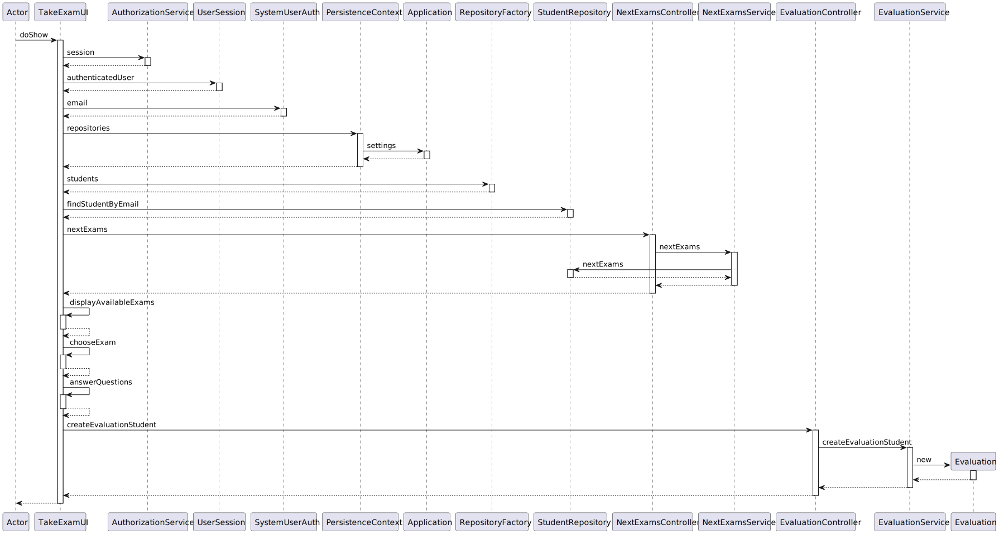
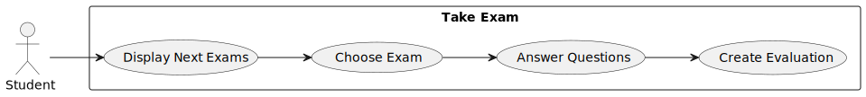

# US 2004

## 1. Context

Exams are an integral part of assessing students' knowledge and understanding in an educational environment. Teachers are responsible for defining the exam details, such as the date, title, course, sequence of sections, and header information. They can also select questions from a question pool to include in the exam. The ability to update exams enables teachers to make adjustments and modifications as needed, ensuring the relevance and effectiveness of the assessment.
## 2. Requirements

**US_2004** As Student, I want to take an Exam

## 3. Analysis

### 3.1 Domain Excerpt

## 4. Design

### 4.1. Sequence Diagram



### 4.2. Use Class Diagram



### 4.3. Applied Patterns
The applied patterns are:
- Service;
- Controller;
- Repository;
- Domain.

### 4.4. Tests
 No tests required since it is a basic UI interaction.
## 5. Implementation

## ExamManagementService.java
```
   public class ExamManagementService {
    ExamRepository examRepository = PersistenceContext.repositories().exams();
    CreateExamController createExamController = new CreateExamController();


    public Iterable<Exam> findAll() {
        return examRepository.findAll();
    }


    public Exam findByCode(String code) {
        return examRepository.findByCode(code);
    }

    public void appendStudent(Student student, Exam ExamCode){
        examRepository.appendStudent(student, ExamCode);
    }
}
```
## Exam.java
```
public class Exam implements AggregateRoot<Code> {

    @Id
    @GeneratedValue (strategy = GenerationType.IDENTITY)
    private Long id ;

    @ManyToMany(cascade = CascadeType.ALL)
    private List<Question> questions;
    private Date date;
    private Header header;
    private SequenceofSections sequenceofSections;
    private Title title;
    @ManyToOne
    private Course course;

    public long getId() {
        return id;
    }

    @OneToMany
    private List<Student> Student;


    protected Exam() {
        // Required by JPA
    }

    public Exam(List<Question> questions, Date date, SequenceofSections sequenceofSections, Title title, Course course,Header header) {
        this.questions = questions;
        this.date = date;
        this.sequenceofSections = sequenceofSections;
        this.title = title;
        this.course = course;
        this.header = header;
    }


    public void appendStudent(Student student) {
        this.Student.add(student);
    }

    /*
    public List<Student> setStudent(List<Student> student) {
        this.Student.addAll(student);
    }
*/

    public Course getCourse() {
        return course;
    }

    public Date getDate() {
        return date;
    }

    //public List<Question> getQuestion() {
    //return questions;
    //}

    public SequenceofSections getSequenceofSections() {
        return sequenceofSections;
    }

    public Title getTitle() {
        return title;
    }

    public List<eapli.base.studentmanagement.domain.Student> getStudent() {
        return Student;
    }

    @Override
    public boolean sameAs(Object other) {
        return false;
    }

    @Override
    public Code identity() {
        return null;
    }


    @Override
    public String toString() {
        return "Exam{" +
                "code=" + id.toString() +
                ", date=" + date.getValue() +
                ", header=" + header.toString() +
                ", sequenceofSections=" + sequenceofSections.getValue() +
                ", title=" + title.getValue() +
                ", Student=" + Student.toString() +
                '}';
    }

    public Header getHeader() {
        return header;
    }

    public List<Question> getQuestions() {
        return questions;
    }
}
```
## EvaluationService.java
```
public class EvaluationService {
    EvaluationRepository evaluationRepository = PersistenceContext.repositories().evaluations();

    public Iterable<Evaluation> allEvaluations() {
        return evaluationRepository.findAll();
    }
    /*
   public Evaluation findById(String code) {
        return evaluationRepository.findById(code);
    }


     */
    public void createEvaluation(Student student, Exam exam, Teacher teacher, int grade){
        Evaluation evaluation = new Evaluation(student, exam, teacher, grade);
        evaluationRepository.save(evaluation);}

    public Iterable<Evaluation> findall() {
        return evaluationRepository.findAll();
    }

    public void createEvaluationStudent(Student student, Exam chosenExam, List<Question> list) {
        Evaluation evaluation = new Evaluation(student,chosenExam,list);
        evaluationRepository.save(evaluation);
    }
}
```
## EvaluationController.java
```
public class EvaluationController {
    EvaluationService evaluationService = new EvaluationService();
    public void createEvaluation(Student student, Exam exam, Teacher teacher, int grade){
         evaluationService.createEvaluation(student, exam, teacher, grade);
    }
    public Iterable<Evaluation> findall() {
        return evaluationService.findall();
    }

    public void createEvaluationStudent(Student student, Exam chosenExam, List<Question> list){
        evaluationService.createEvaluationStudent(student,chosenExam,list);
    }
}
```
## Evaluation.java
```
@Entity(name = "Evaluation")
public class Evaluation implements AggregateRoot<Code> {
    //a student takes an exam
    @ManyToOne

    private final Student student;
    @ManyToOne

    private final Exam exam;

    @Id
    @GeneratedValue(strategy = GenerationType.IDENTITY)
    private Long id ;
    @ManyToOne

   private final Teacher teacher;
    private int grade;

    @OneToMany
    private List<Question> questions;

    public Evaluation() {
        this.student = null;
        this.exam = null;
        this.id = null;
        this.teacher = null;
        this.grade = 0;
    }

    public Evaluation(Student student, Exam chosenExam, List<Question> list) {
        this.student = student;
        this.exam = chosenExam;
        this.grade=0;
        this.teacher=null;
        this.questions = list;
    }


    public Student getStudent() {
        return student;
    }

    public Exam getExam() {
        return exam;
    }


    public Evaluation(Student student, Exam exam, Teacher teacher, int grade) {
        this.student = student;
        this.exam = exam;
        this.teacher = teacher;
        this.grade = grade;
    }

    public void setGrade(int grade) {
        if (grade >= 0 && grade <= 20) {
            this.grade = grade;
        }
    }
    @Override
    public boolean sameAs(Object other) {
        return false;
    }

    @Override
    public Code identity() {
        return null;
    }

    public long getId() {
        return this.id;
    }

    public  long getGrade(){
        return this.grade;
    }
}
```

## 6. Integration/Demonstration


## 7. Observations

