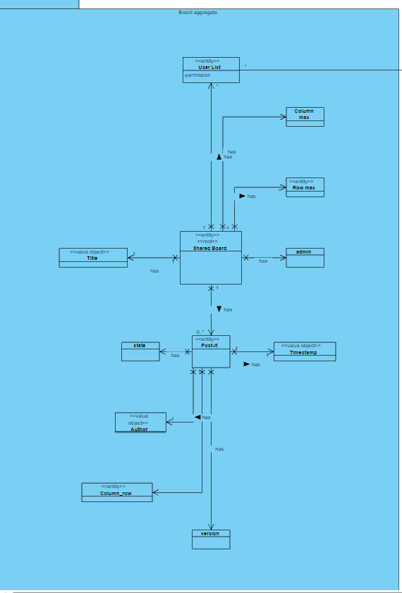
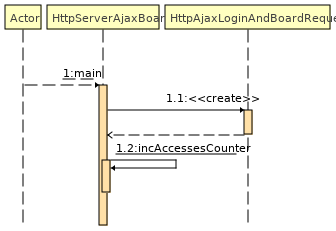
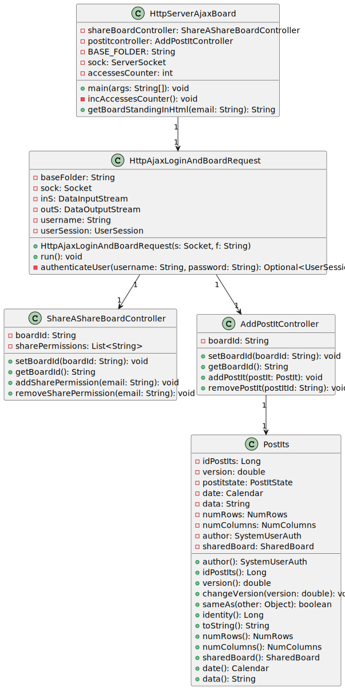

# US 3005

## 1. Context
Real-time updates in shared boards allow users to view the latest changes as they occur. This is made possible using Ajax, which enables data retrieval from the server without refreshing the entire page. With Ajax, users can instantly see any updates on the shared board without manually reloading the page.

## 2. Requirements

**US_3005** As User, I want to view, in real-time, the updates in the shared boards

## 3. Analysis

### 3.1 Domain Excerpt

## 4. Design

### 4.1. Sequence Diagram



### 4.2. Use Class Diagram


## 4.3 Class Diagram


### 4.4. Applied Patterns
The applied patterns are:
- Service;
- Controller;
- Repository;
- Domain.

## 5. Implementation
### 5.1. HTML
```<html>
<head>
    <title>BoardViewer</title>
    <style>
        body {
            background-color: #FFFFFF;
            font-family: Arial, sans-serif;
            text-align: center;
            margin-top: 50px;
        }

        h1 {
            color: #3d4550;
        }
        h3 {
            color: #7f8fa5;
        }

        form {
            display: inline-block;
            text-align: left;
            padding: 20px;
            border-radius: 5px;
            background-color: #FFFFFF;
            box-shadow: 0px 2px 10px rgba(0, 0, 0, 0.2);
        }

        label {
            display: block;
            margin-bottom: 5px;
            color: #333;
        }

        input[type="text"],
        input[type="password"] {
            width: 250px;
            padding: 5px;
            border: 1px solid #999;
            border-radius: 3px;
        }

        button[type="submit"] {
            display: block; /* Add this line */
            margin: 0 auto; /* Add this line */
            padding: 10px 20px;
            background-color: #3d4550;
            color: #FFF;
            border: none;
            border-radius: 3px;
            cursor: pointer;
        }

        #votes {
            margin-top: 20px;
            color: #666;
        }
    </style>
    <script src="login.js"></script>
    <script src="rcomp-ajax.js"></script>
    <script src="Boards-ajax.js"></script>
    <script>
        function togglePasswordVisibility() {
            var passwordInput = document.getElementById("password");
            if (passwordInput.type === "password") {
                passwordInput.type = "text";
            } else {
                passwordInput.type = "password";
            }
        }
    </script>
</head>
<body>
<h1>Board Viewer</h1>
<h3>Java version</h3>
<form id="loginForm" onsubmit="submitLoginForm(event)">
    <label for="username">E-mail:</label>
    <input type="text" id="username" name="username" required><br><br>
    <label for="password">Password:</label>
    <input type="password" id="password" name="password" required>
    <input type="checkbox" onclick="togglePasswordVisibility()"> <br><br>
    <button type="submit">Login</button>
</form>
<div id="votes" style="display: none">
    Please wait, loading voting results ...
</div>
</body>
</html>
```
### 5.2 JavaScript
#### 5.2.1 login.js
```
function submitLoginForm(event) {
    event.preventDefault(); // Prevent form submission

    // Get the form values
    var username = document.getElementById("username").value;
    var password = document.getElementById("password").value;

    // Make an AJAX request to the server for login validation
    var request = new XMLHttpRequest();
    request.onload = function() {
        if (request.status === 200) {
            // Successful login
            document.getElementById("loginForm").style.display = "none";
            refreshBoard(username); // Pass the username to the refreshBoard function
            document.getElementById("votes").style.display = "block";
        } else {
            // Invalid login
            alert("Invalid username or password. Please try again.");
        }
    };
    request.open("POST", "/login", true);
    request.setRequestHeader("Content-Type", "application/json");
    request.send(JSON.stringify({ username: username, password: password }));
}
```
#### 5.2.2 Boards-ajax.js
```
function refreshBoard(username) {
    var request = new XMLHttpRequest();
    var vBoard = document.getElementById("votes");

    request.onload = function () {
        vBoard.innerHTML = this.responseText;
        vBoard.style.color = "black";
        setTimeout(function () {
            refreshBoard(username);
        }, 2000);
    };

    request.ontimeout = function () {
        vBoard.innerHTML = "Server timeout, still trying ...";
        vBoard.style.color = "red";
        setTimeout(function () {
            refreshBoard(username);
        }, 100);
    };

    request.onerror = function () {
        vBoard.innerHTML = "No server reply, still trying ...";
        vBoard.style.color = "red";
        setTimeout(function () {
            refreshBoard(username);
        }, 5000);
    };

    var url = "/board";
    var requestBody = "username=" + encodeURIComponent(username);

    request.open("POST", url, true);
    request.timeout = 5000;
    request.setRequestHeader("Content-type", "application/x-www-form-urlencoded");
    request.send(requestBody);
}

```


## 6. Integration/Demonstration

## 7. Observations
| Code          | Message                 |
| ------------- | ----------------------- |
| 200           | OK                      |
| 404  | File not found          |
| 401  | Unauthorized            |
| 405  | ERROR: 405 Method Not Allowed |

| Method | URI     |
| ------ | ------- |
| GET    | /       |
| POST   | /login  |
| GET    | /board  |


