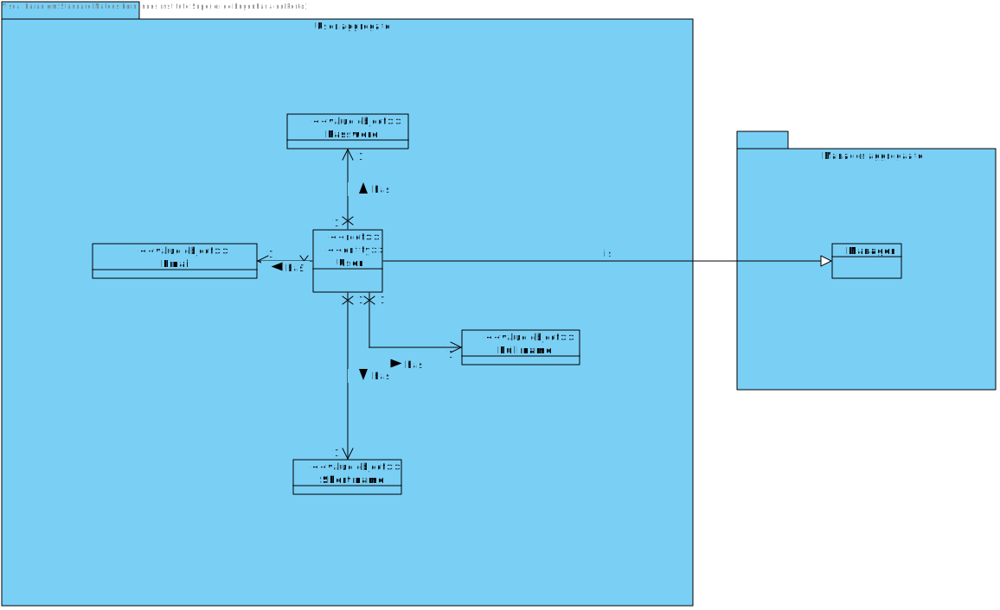
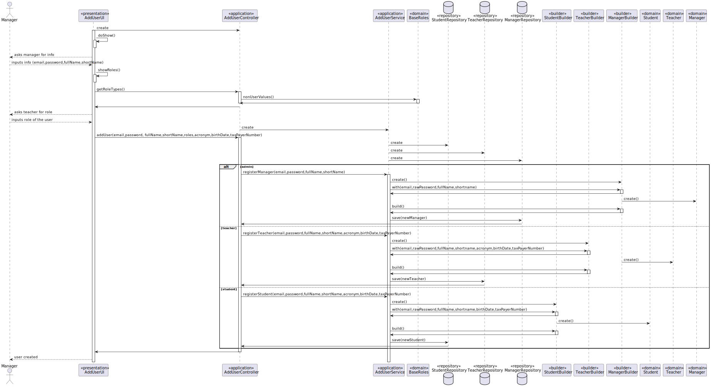
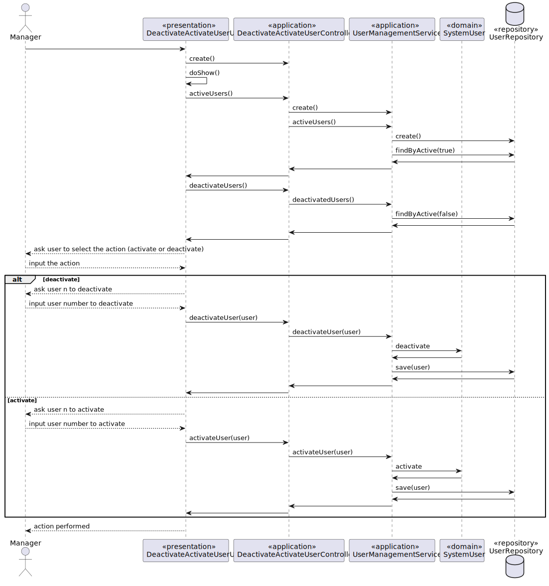
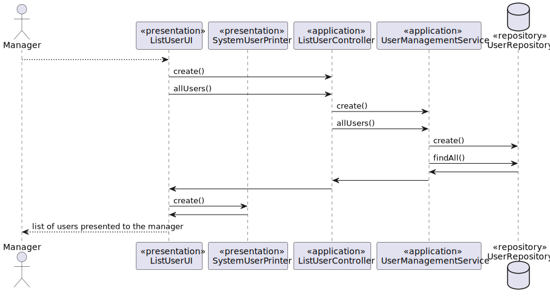
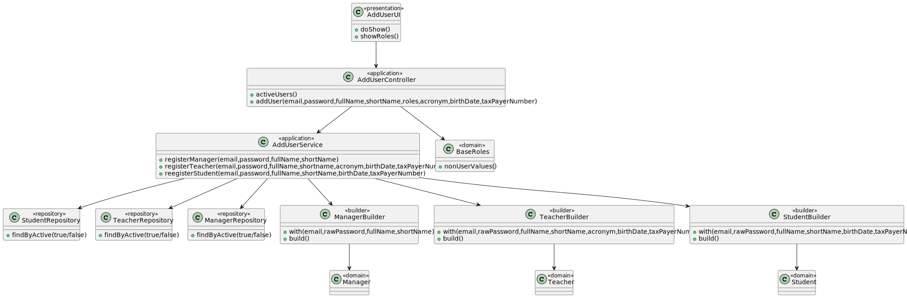
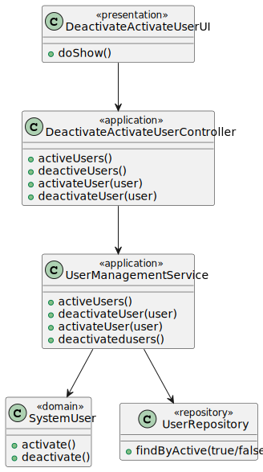
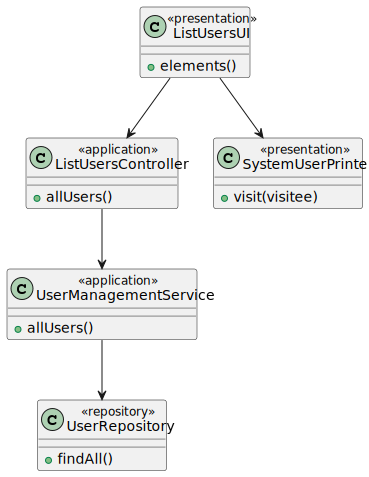

# US 1001

## 1. Context

**US1001** As Manager, I want to be able to register, disable/enable, and list users of the system (Teacher and Students, as well as Managers)

This a task assigned to a user associated with a role manager and makes it able for him to register a user, list all users and deativate/activate user

## 2. Requirements

### 2.1 Customer Specifications and Clarifications

**From the specification document:**

>- FRU01 -  **Management of Users** Create, disable/enable, and list users of the system (Teacher and Students, as well as Managers)

**From the client clarifications:**

### 2.2 Acceptance Criteria

-N/A

### 2.3 Found Out Dependencies

### 2.4 Input and Output Data

### Add User 

**Input Data:**

* Typed data:
    * Manager Login
    * User email
    * User password
    * User full name
    * User short name

* Selected data:
    * Option to add user 
    * User role

**Output Data:**

### List Users

**Input Data:**

* Typed data:
  * Manager Login

* Selected data:
  * Option to list users

**Output Data:**

* UI:
  * User list

### Deactivate/Activate User

**Input Data:**

* Typed data:
  * Manager Login
  * Option to activate/deactivate
  * Number of user to deactivate

* Selected data:
  * Option to activate/deactivate

**Output Data:**


## 3. Analysis

### 3.1 Domain Excerpt


## 4. Design

### 4.1. Sequence Diagram





### 4.2. Class Diagram





### 4.3. Applied Patterns

The applied patterns are:
- Service;
- Controller;
- Repository;
- Domain.

### 4.4. Tests

## 5. Implementation

## AddUserController.java
```
        authz.ensureAuthenticatedUserHasAnyOf(BaseRoles.POWER_USER, BaseRoles.ADMIN);
        List<Role> list;
        list = roles.stream().collect(Collectors.toCollection(ArrayList::new));
        switch(list.get(0).toString()){
            case "ADMIN":{
                svc.registerManager(email,password,fullName,shortName);
                break;
            }
            case "TEACHER":{
                svc.registerTeacher(email,password,fullName,shortName,acronym,birthDate,taxPayerNumber);
                break;
            }
            case "STUDENT":{
                svc.registerStudent(email,password,fullName,shortName,birthDate,taxPayerNumber);
                break;
            }

```

## DeactivateActivateUserController.java
```
        authz.ensureAuthenticatedUserHasAnyOf(BaseRoles.POWER_USER, BaseRoles.ADMIN);
        return userSvc.activeUsers();
        
        authz.ensureAuthenticatedUserHasAnyOf(BaseRoles.POWER_USER, BaseRoles.ADMIN);
        return userSvc.deactivateUser(user);
        
        authz.ensureAuthenticatedUserHasAnyOf(BaseRoles.POWER_USER, BaseRoles.ADMIN);
        return userSvc.activateUser(user);
        
        authz.ensureAuthenticatedUserHasAnyOf(BaseRoles.POWER_USER, BaseRoles.ADMIN);
        return userSvc.deactivedUsers();

```

## ListUsersController.java
```
       authz.ensureAuthenticatedUserHasAnyOf(BaseRoles.POWER_USER, BaseRoles.ADMIN);
       return userSvc.allUsers();
```


## 6. Integration/Demonstration

*In this section the team should describe the efforts realized in order to integrate this functionality with the other parts/components of the system*

*It is also important to explain any scripts or instructions required to execute an demonstrate this functionality*

## 7. Observations

*This section should be used to include any content that does not fit any of the previous sections.*

*The team should present here, for instance, a critical prespective on the developed work including the analysis of alternative solutioons or related works*

*The team should include in this section statements/references regarding third party works that were used in the development this work.*