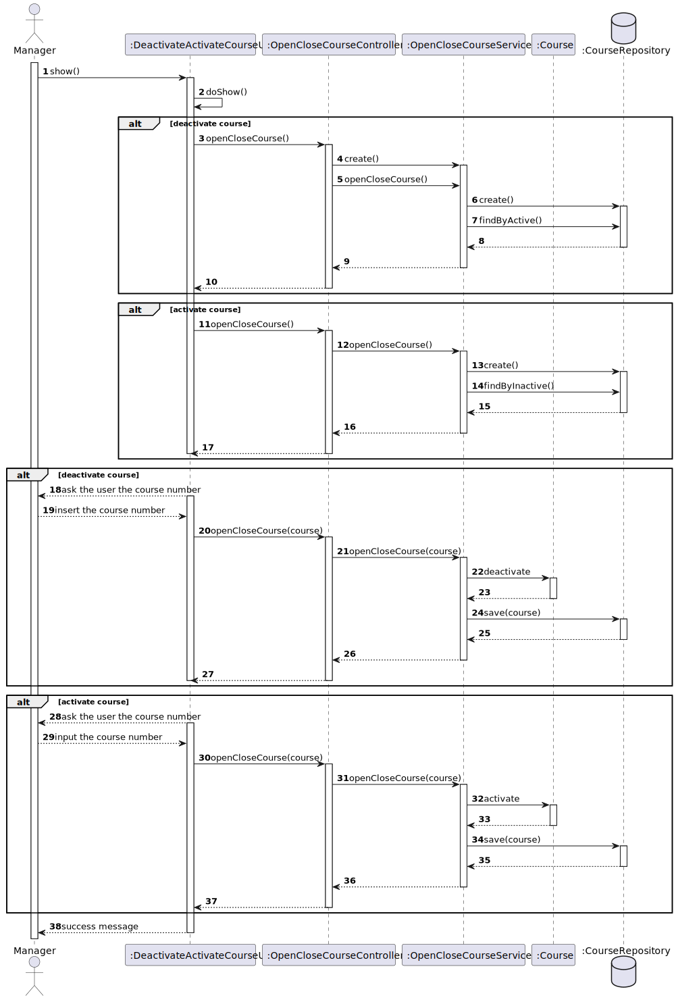

# US 1004

## 1. Context

**US1004** - As Manager, I want to open and close courses.

This a task assigned to a user associated with a role manager and makes it able for him to activate/deactivate a course.

## 2. Requirements

### 2.1 Customer Specifications and Clarifications

**From the specification document:**

> - FRC03 - Open/Close Course Only managers are able to execute this functionality.
> - "(...) A course may be open or closed. A
    closed course can not have any activity (...)".

**From the client clarifications:**

> - n/a

### 2.2 Acceptance Criteria

> - n/a

### 2.3 Found Out Dependencies
* "US1002: As Manager, I want to create courses."

### 2.4 Input and Output Data
**Input Data:**

* Typed data:
    * Number of the Course on the list

* Selected data:
    * Course


**Output Data:**

* UI
    * Course closed or opened by the manager
* File
    * n/a


## 3. Analysis

### 3.1 Domain Excerpt


## 4. Design

### 4.1. Sequence Diagram



### 4.2. Class Diagram


### 4.3. Applied Patterns

The applied patterns are:
- Service;
- Controller;
- Repository;
- Domain.

### 4.4. Tests

## 5. Implementation

## DeactivateActivateUserController.java
```
      public Iterable<Course> findAllActive() {
        return courseRepository.findAllActive();
    }
      public Iterable<Course> findAllInactive() {
        return courseRepository.findAllInactive();
    }
    
      public void deactivateCourse (Course course){
        courseRepository.deactivateCourse(course);
    }

      public void activateCourse (Course course){
        courseRepository.activateCourse(course);
    }


```

## 6. Integration/Demonstration

*In this section the team should describe the efforts realized in order to integrate this functionality with the other parts/components of the system*

*It is also important to explain any scripts or instructions required to execute an demonstrate this functionality*

## 7. Observations

*This section should be used to include any content that does not fit any of the previous sections.*

*The team should present here, for instance, a critical prespective on the developed work including the analysis of alternative solutioons or related works*

*The team should include in this section statements/references regarding third party works that were used in the development this work.*