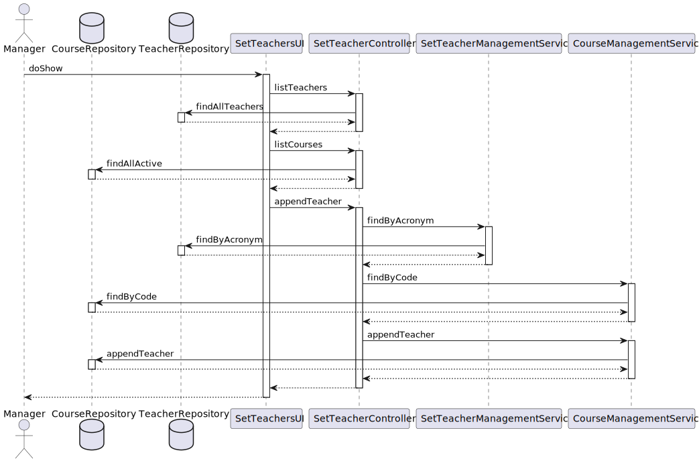
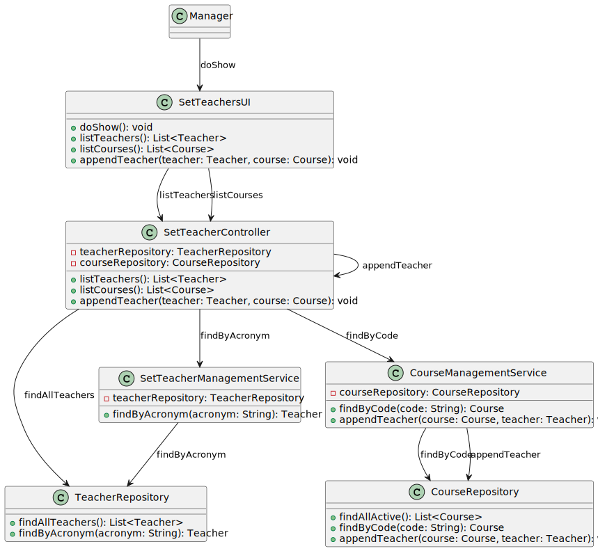

# US1005 - Set the teachers of a course

## 1. Requirements Engineering

### 1.1. User Story Description

As Manager, I want to set the teachers of a course.

### 1.2. Customer Specifications and Clarifications

**From the specifications document:**

> - **FRC04 - Set Course Teachers-** Each course may have several teachers and must have
    only one Teacher in Charge. Only managers are able to execute this functionality.

    

### 1.3. Acceptance Criteria

- n/a

### 1.4. Found out Dependencies

- n/a

### 1.5 Input and Output Data

**Input Data:**

* Typed data:
    * Teacher´s Acronym
    * Course´s Code

* Selected data:
    * Teacher
    * Course
  

**Output Data:**

* UI
    * Teacher set to a Course by the Manager
* File
    * n/a

### 1.7 Other Relevant Remarks

* n/a

## 2. OO Analysis

### 2.1. Relevant Domain Model Excerpt

### 2.2. Other Remarks

n/a

## 3.2. Sequence Diagram (SD)

## 3.3. Class Diagram (CD)

## 3.4. Use Case Diagram (UCD)

