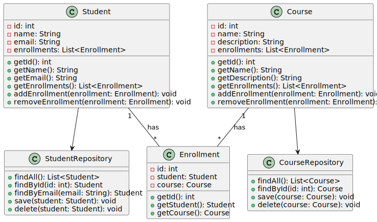

# US1006 - List all the courses that are available to a User

## 1. Requirements Engineering

### 1.1. User Story Description

As User, I want to list all the courses that are available to me.

### 1.2. Customer Specifications and Clarifications

**From the specifications document:**

> - **FRC05 - List Courses-** All users are able to execute this functionality.

**From the client clarifications:**

> **Question:** "Relative to this US, "As User, I want to list all the courses that are available to me" what should we list according to the User role? 
> - Student: Courses that Student is enrolled
> - Teacher: Courses that Teacher teaches  
> - Manager: All Courses 
> 
> Are these assumptions right?"

> **Answer:** 
> Regarding Teachers and Managers I agree with you.
>
> Regarding students I think it is best to list all the courses in which the student is enrolled or may be enrolled (the enrolments are opened). If not, how would a student know the courses in which he/she can enrol?

### 1.3. Acceptance Criteria

- n/a

### 1.4. Found out Dependencies

* "US1002: As Manager, I want to create courses."

### 1.5 Input and Output Data

**Input Data:**

* Typed data:
    * n/a

* Selected data:
    * n/a

**Output Data:**

* UI
    * Display Courses Available to each user (Manager,Student,Teacher)
* File
    * n/a

### 1.7 Other Relevant Remarks

* n/a

## 2. OO Analysis

### 2.1. Relevant Domain Model Excerpt

### 2.2. Other Remarks

n/a

## 3.2. Sequence Diagram (SD)

- ### As Manager

- ###    As Teacher

- ### As Student

## 3.3. Class Diagram (CD)

- ### As Manager

- ###    As Teacher

- ### As Student

## 3.4. Use Case Diagram (UCD)
