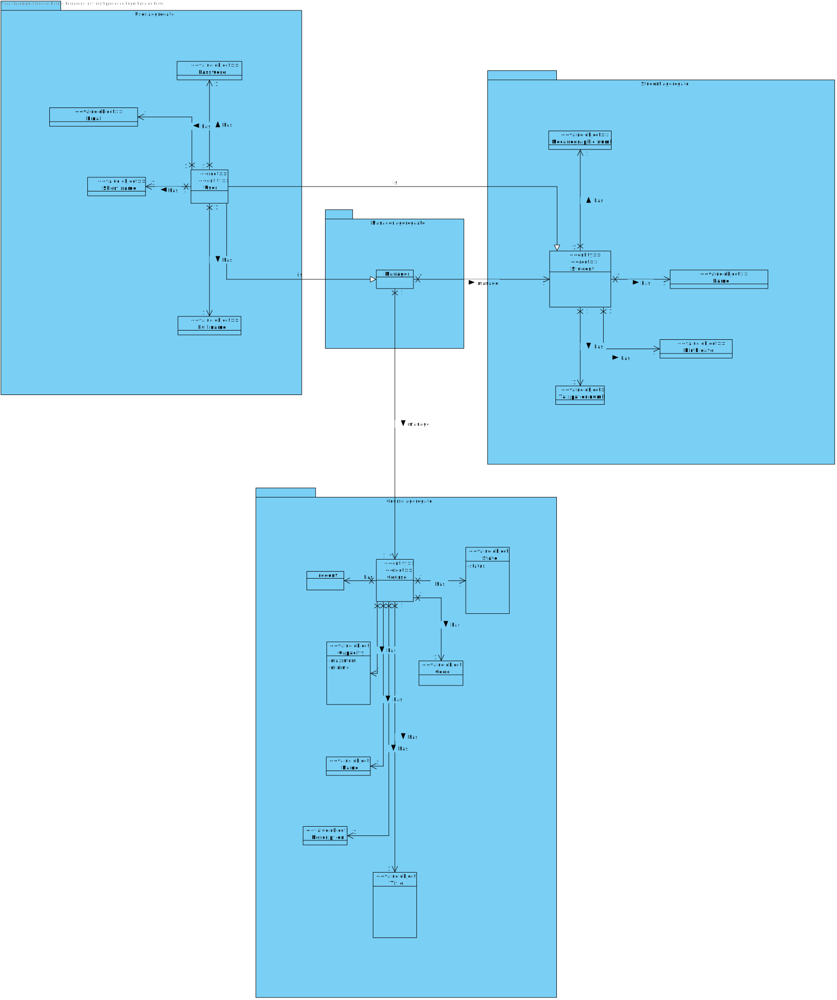

# US 1007

## 1. Context

**US1007** As Manager, I want to enroll students in bulk by importing their data using a csv file

This a task assigned to a user associated with a role manager and makes it able for this user to enroll students in a bulk.

## 2. Requirements

### 2.1 Customer Specifications and Clarifications

**From the specification document:**

>- FRC06 -  **Bulk Enroll Students in Course** This can be made by importing a csv file with students. Only managers are able to execute this functionality

**From the client clarifications:**

>**Question:** "Will we have a csv file example for the students data?"
>
>**Answer:** "No, the client did not prepare any csv example. CSV is a standard file format. You should support the bulk enrolment of students in a course by have their identification in a csv file."
>
> **Question:** "Relativamente a este caso de uso, devermos assumir que todos os estudantes já estão registados como utilizadores do sistema? Caso negativo, será necessário efetuar a sua inscrição?"
>
> **Answer:** "N/A"
> 
> **Question:** "The students enrolled in bulk are students already registered? Or should they be registered and then enrolled after importing from the CSV file?"
>
> **Answer:** "I would argue that "enroll" is different from "register". A student to be enrolled in a course must be a registered user.o be a student you must be registered as student. Enrolment does not include registration of users as students."


### 2.2 Acceptance Criteria

-N/A

### 2.3 Found Out Dependencies

### 2.4 Input and Output Data

**Input Data:**

* Typed data:
    * Manager Login
    * Course for the students to be enrolled
    * Path to csv file

* Selected data:
    * Option to enroll students in bulk
    * Course 

**Output Data:**

## 3. Analysis

### 3.1 Domain Excerpt


## 4. Design

### 4.1. Sequence Diagram


### 4.2. Class Diagram


### 4.3. Applied Patterns

The applied patterns are:
- Service;
- Controller;
- Repository;
- Domain.

### 4.4. Tests

**Test 1:** *Verifies that it is not possible to put an invalid title for the course*

```
@Test
    public void ensureCourseTitleCantBeNullOrEmpty(){
        Assertions.assertThrows(IllegalArgumentException.class, () -> new Course("JAVA", null
                , "Java Collections Framework", CourseState.CLOSE, new Teacher("AMS"
                , "21321312", LocalDate.of(1990,12,03), null)));

        Assertions.assertThrows(IllegalArgumentException.class, () -> new Course("JAVA"
                , "", "Java Collections Framework"
                , CourseState.CLOSE, new Teacher("AMS", "21321312"
                , LocalDate.of(1990,12,03), null)));
    }
```
**Test2** *Verifies that it is not possible to put an invalid code for the course*
```
    @Test
    public void ensureCourseCodeCantBeNullOrEmpty(){
        Assertions.assertThrows(IllegalArgumentException.class, () -> {
            new Course(null, "Java Collections Framework",
                    "Java Collections Framework", CourseState.CLOSE, new Teacher("AMS",
                    "21321312", LocalDate.of(1990,12,03), null));
        });

        Assertions.assertThrows(IllegalArgumentException.class, () -> {
            new Course("", "Java Collections Framework",
                    "Java Collections Framework", CourseState.CLOSE, new Teacher("AMS",
                    "21321312", LocalDate.of(1990,12,03), null));
        });
    }
```
**Test3** *Verifies that it is not possible to put an invalid description for the course*
```
    @Test
    public void ensureCourseDescriptionCantBeNullOrEmpty(){
        Assertions.assertThrows(IllegalArgumentException.class, () -> {
            new Course("JAVA", "Java Collections Framework",
                    null, CourseState.CLOSE, new Teacher("AMS",
                    "21321312", LocalDate.of(1990,12,03), null));
        });

        Assertions.assertThrows(IllegalArgumentException.class, () -> {
            new Course("JAVA", "Java Collections Framework",
                    "", CourseState.CLOSE, new Teacher("AMS",
                    "21321312", LocalDate.of(1990,12,03), null));
        });
    }
```

## 5. Implementation

## EnrollStudentController.java
```
        authz.ensureAuthenticatedUserHasAnyOf(BaseRoles.ADMIN);
        svc.loadCSV(path,course);
```


## 6. Integration/Demonstration

*In this section the team should describe the efforts realized in order to integrate this functionality with the other parts/components of the system*

*It is also important to explain any scripts or instructions required to execute an demonstrate this functionality*

## 7. Observations

*This section should be used to include any content that does not fit any of the previous sections.*

*The team should present here, for instance, a critical prespective on the developed work including the analysis of alternative solutioons or related works*

*The team should include in this section statements/references regarding third party works that were used in the development this work.*