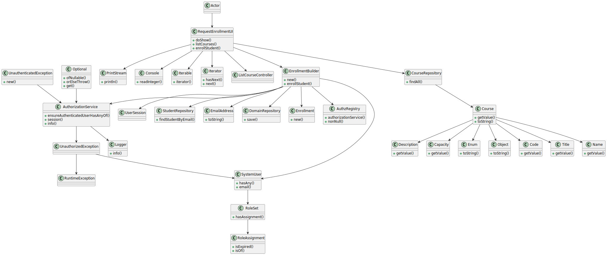

# US1008 - Enrollment in a course

## 1. Requirements Engineering


### 1.1. User Story Description


As Student, I want to request my enrollment in a course

### 1.2. Customer Specifications and Clarifications


**From the specifications document:**

> - FRC07 - Request Enrollment in Course The student requests to be enrolled in a course


**From the client clarifications:**

- n/a

### 1.3. Acceptance Criteria

- n/a


### 1.4. Found out Dependencies


* "US1002: As Manager, I want to create courses."
* "US1003: As Manager, I want to open and close enrollements in courses."
* "US1004: As Manager, I want to open and close courses."


### 1.5 Input and Output Data


**Input Data:**

* Typed data:
    * Number of the Course on the list

* Selected data:
    * Course


**Output Data:**

* UI
    * Information that the request was made


## 2. OO Analysis

### 2.1. Relevant Domain Model Excerpt


### 2.2. Other Remarks

n/a


## 3. Design - User Story Realization

### 3.1. Rationale

### Systematization ##

According to the taken rationale, the conceptual classes promoted to software classes are:

* 

Other software classes (i.e. Pure Fabrication) identified:

* 


## 3.2. Sequence Diagram (SD)


## 3.3. Class Diagram (CD)




### 4.4. Tests
**Test1** **
```

```
**Test2** **
```

```

## 5. Implementation

## EnrollmentService.java
```
/**
 * The type Enrollment service.
 *
 * @author joaomorais
 */
public class EnrollmentService {

    /**
     * The Enrollment repository.
     */
    EnrollmentRepository enrollmentRepository = PersistenceContext.repositories().enrollments();
    /**
     * The Student repository.
     */
    StudentRepository studentRepository = PersistenceContext.repositories().students();


    private final AuthorizationService authorizationService;

    /**
     * Instantiates a new Enrollment service.
     */
    public EnrollmentService() {
       authorizationService = AuthzRegistry.authorizationService();
        authorizationService.ensureAuthenticatedUserHasAnyOf(BaseRoles.STUDENT);
    }


    /**
     * Enroll student boolean.
     *
     * @param course the course
     * @return the boolean
     */
    public boolean enrollStudent(Course course){

        String emailAddress  = authorizationService.session().get().authenticatedUser().email().toString();

        Student student = studentRepository.findStudentByEmail(emailAddress);

        Enrollment newEnrollment = new Enrollment(student,course);
        enrollmentRepository.save(newEnrollment);

        return true;
    }


    public boolean enrollStudentwithstudent(Course course,Student student){

        Enrollment newEnrollment = new Enrollment(student,course);
        enrollmentRepository.save(newEnrollment);

        return true;
    }


    /**
     * List enrollments iterable.
     *
     * @return the iterable
     */
    public Iterable<Enrollment> listEnrollments() {
        return enrollmentRepository.findAll();
    }


}

```

