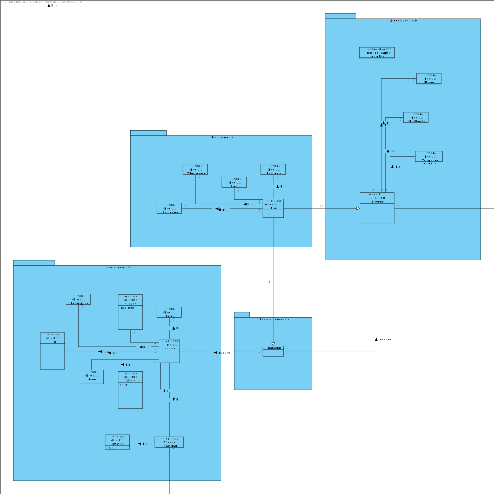
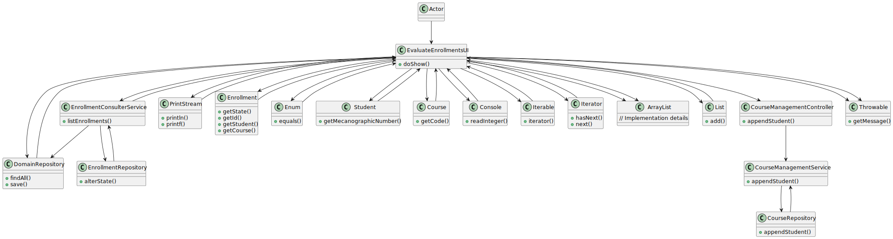

# US1009 - Approve or Reject Enrollment in a course

## 1. Requirements Engineering


### 1.1. User Story Description


As Manager, I want to approve or reject students applications to courses

### 1.2. Customer Specifications and Clarifications


**From the specifications document:**

> - FRC08 - Approve/Reject Enlistment in Course A manager approves or rejects a students’ application to a course.


**From the client clarifications:**

> **Question:** "We would like to know what are the requirements for a student to be accepted or rejected from an application  to a course."
>
> **Answer:** "I think that decision can not be automatically taken by the system, it is a decision of the manager. The responsibility is of the manager according to course rules that ar out of the scope of this implementation. I think the system should only register the reason for the decision."


### 1.3. Acceptance Criteria

- n/a


### 1.4. Found out Dependencies


* "US1002: As Manager, I want to create courses."
* "US1003: As Manager, I want to open and close enrollements in courses."
* "US1004: As Manager, I want to open and close courses."
* "US1008: As Student, I want to request my enrollment in a course."


### 1.5 Input and Output Data


**Input Data:**

* Typed data:
    * Number of the request of enrollment

* Selected data:
    * Student Enrollment


**Output Data:**

* UI
    * Information that the request was aproved or denied


## 2. OO Analysis

### 2.1. Relevant Domain Model Excerpt



### 2.2. Other Remarks

n/a


## 3. Design - User Story Realization

### 3.1. Rationale

### Systematization ##

According to the taken rationale, the conceptual classes promoted to software classes are:

*

Other software classes (i.e. Pure Fabrication) identified:

*


## 3.2. Sequence Diagram (SD)


## 3.3. Class Diagram (CD)




### 4.4. Tests
**Test1** **
```

```
**Test2** **
```

```

## 5. Implementation

## EnrollmentConsulterService.java
```
/**
 * The type Enrollment consulter service.
 *
 * @author joaomorais
 */
public class EnrollmentConsulterService {

    /**
     * The Enrollment repository.
     */
    EnrollmentRepository enrollmentRepository = PersistenceContext.repositories().enrollments();


    /**
     * List enrollments iterable.
     *
     * @return the iterable
     */
    public Iterable<Enrollment> listEnrollments() {
        return enrollmentRepository.findAll();
    }


    /**
     * Alter state enrollment.
     *
     * @param student the student
     * @param course  the course
     * @return the enrollment
     */
    public Enrollment alterState(Student student, Course course) {return enrollmentRepository.alterState(student,course);}


}


```

