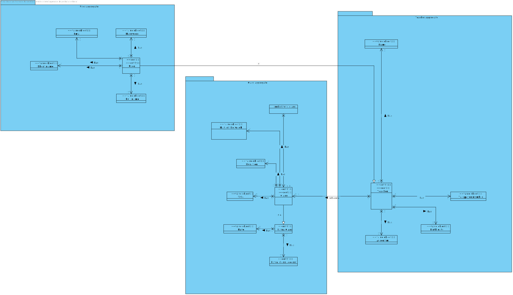
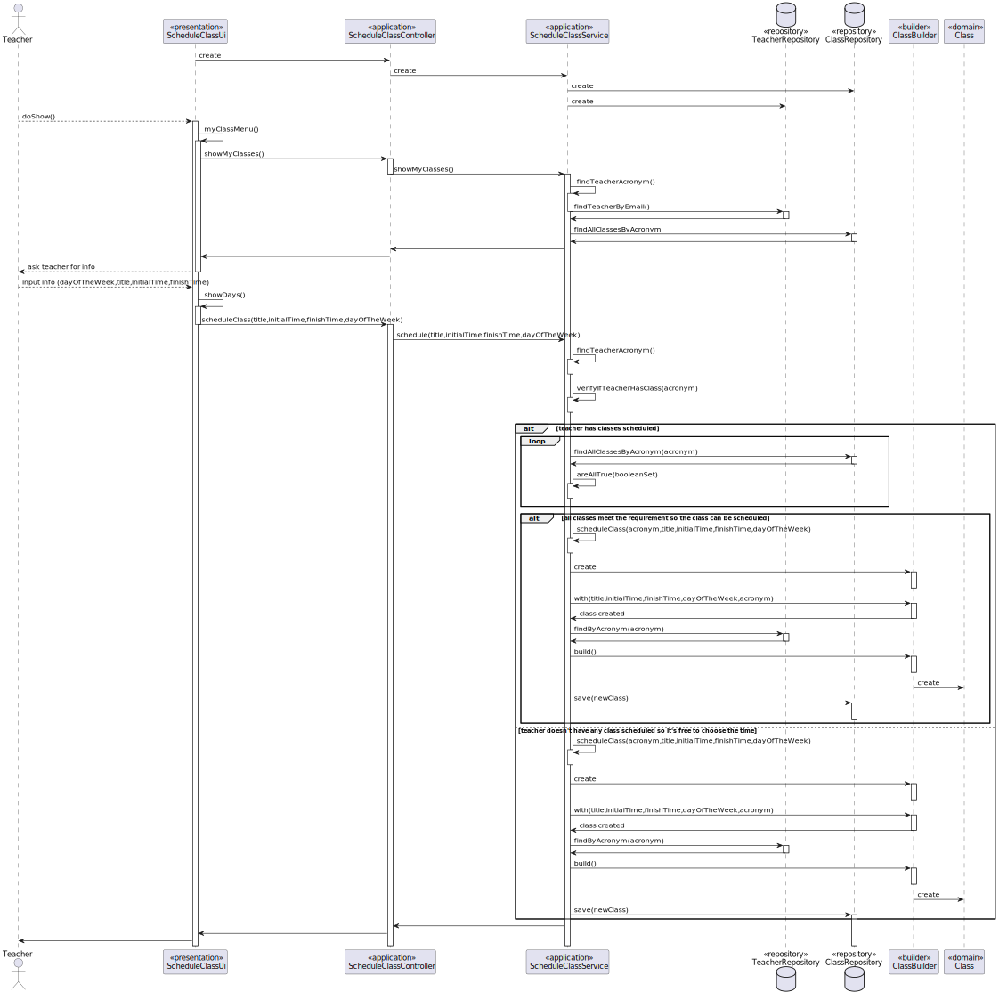
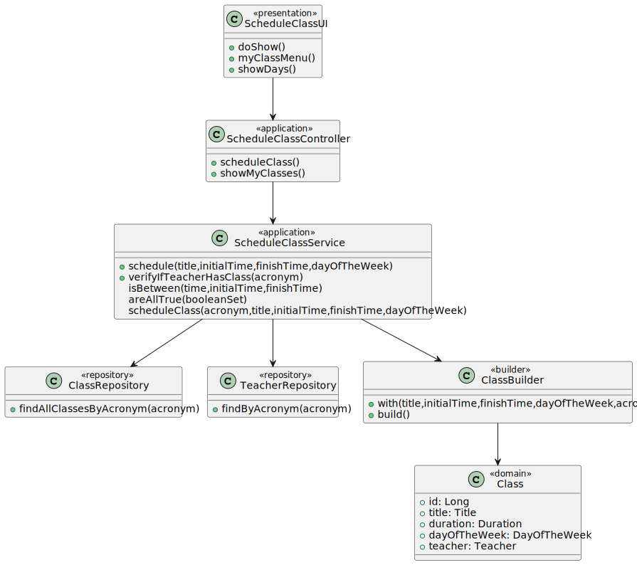

# US 1010

## 1. Context

**US1010** As Teacher, I want to schedule a class

This a task assigned to a user associated with a role teacher and makes it able for this user to schedule a class.

## 2. Requirements

### 2.1 Customer Specifications and Clarifications

**From the specification document:**

>- FRC09 -  **Schedule of Class** A teacher schedule a class (always a recurring class, happens every week). System must check if the Teacher is available for the class period

**From the client clarifications:**

>**Question:** "We have a question about a class scheduling. When a teacher wants to schedule a class, do they introduce start date/time and end date/time, or start date/time and duration of the class? And in general, how often will the client want to consult the duration of the classes?"
>
>**Answer:** "We have a question about a class scheduling. When a teacher wants to schedule a class, do they introduce start date/time and end date/time, or start date/time and duration of the class? And in general, how often will the client want to consult the duration of the classes?"
>
> **Question:** "Nestas duas US, pretende que seja mostrada a lista de Class/ExtraClass que já estão agendadas para que o professor saiba onde pode agendar?"
>
> **Answer:** "Em termos de requisitos é importante que o sistema garanta as regras que estão descritas em 5.1.2 relativo a aulas e aulas extra. Em termos de user interface para cada um desses casos de uso não existem requisitos específicos. Nesse aspeto de "user experience" devem seguir boas práticas. Mas isso já faz parte do desenho da solução"
>
> **Question:** "From what time to what time can a class be scheduled (eg: can the course have a class at 3AM?). And what’s the minimum and maximum duration for a class? i supose we can’t have 43m classes?"
>
> **Answer:** "N/A"
> 
> **Question:** "Good afternoon, I've a question regarding the shedule of a class. A teacher can only schedule classes to a given course that he/her is in?"
>
> **Answer:** "N/A"
> 
> **Question:** "Good afternoon, I've a question regarding the shedule of a class and of an extra class. Is it possible (or there should be a warning) to schedule a class and/or an extra class when a student and/or teacher, that will be part of it, have a meeting at the same time that the class will happen?"
>
> **Answer:** "N/A"
> 
> **Question:** "The teacher that schedules the class is the one that will give it, or can one teacher schedule a class that will be assigned to another teacher?"
>
> **Answer:** "N/A" 

### 2.2 Acceptance Criteria

-N/A

### 2.3 Found Out Dependencies

### 2.4 Input and Output Data

**Input Data:**

* Typed data:
    * Teacher Login
    * Class title
    * Class start time
    * Class end time

* Selected data:
    * Option to schedule class
    * Class day of the week

**Output Data:**

## 3. Analysis

### 3.1 Domain Excerpt


## 4. Design

### 4.1. Sequence Diagram



### 4.2. Class Diagram




### 4.3. Applied Patterns

The applied patterns are:
- Service;
- Controller;
- Repository;
- Domain.

### 4.4. Tests

**Test 1:** *Verifies that it is not possible to put an invalid title for the course*

```
@Test
    public void ensureCourseTitleCantBeNullOrEmpty(){
        Assertions.assertThrows(IllegalArgumentException.class, () -> new Course("JAVA", null
                , "Java Collections Framework", CourseState.CLOSE, new Teacher("AMS"
                , "21321312", LocalDate.of(1990,12,03), null)));

        Assertions.assertThrows(IllegalArgumentException.class, () -> new Course("JAVA"
                , "", "Java Collections Framework"
                , CourseState.CLOSE, new Teacher("AMS", "21321312"
                , LocalDate.of(1990,12,03), null)));
    }
```
**Test2** *Verifies that it is not possible to put an invalid code for the course*
```
    @Test
    public void ensureCourseCodeCantBeNullOrEmpty(){
        Assertions.assertThrows(IllegalArgumentException.class, () -> {
            new Course(null, "Java Collections Framework",
                    "Java Collections Framework", CourseState.CLOSE, new Teacher("AMS",
                    "21321312", LocalDate.of(1990,12,03), null));
        });

        Assertions.assertThrows(IllegalArgumentException.class, () -> {
            new Course("", "Java Collections Framework",
                    "Java Collections Framework", CourseState.CLOSE, new Teacher("AMS",
                    "21321312", LocalDate.of(1990,12,03), null));
        });
    }
```
**Test3** *Verifies that it is not possible to put an invalid description for the course*
```
    @Test
    public void ensureCourseDescriptionCantBeNullOrEmpty(){
        Assertions.assertThrows(IllegalArgumentException.class, () -> {
            new Course("JAVA", "Java Collections Framework",
                    null, CourseState.CLOSE, new Teacher("AMS",
                    "21321312", LocalDate.of(1990,12,03), null));
        });

        Assertions.assertThrows(IllegalArgumentException.class, () -> {
            new Course("JAVA", "Java Collections Framework",
                    "", CourseState.CLOSE, new Teacher("AMS",
                    "21321312", LocalDate.of(1990,12,03), null));
        });
    }
```

## 5. Implementation

## ScheduleClassController.java
```
        authz.ensureAuthenticatedUserHasAnyOf(BaseRoles.TEACHER);
        svc.schedule(title,initialTime,finishTime,dayOfTheWeek);
```


## 6. Integration/Demonstration

*In this section the team should describe the efforts realized in order to integrate this functionality with the other parts/components of the system*

*It is also important to explain any scripts or instructions required to execute an demonstrate this functionality*

## 7. Observations

*This section should be used to include any content that does not fit any of the previous sections.*

*The team should present here, for instance, a critical prespective on the developed work including the analysis of alternative solutioons or related works*

*The team should include in this section statements/references regarding third party works that were used in the development this work.*