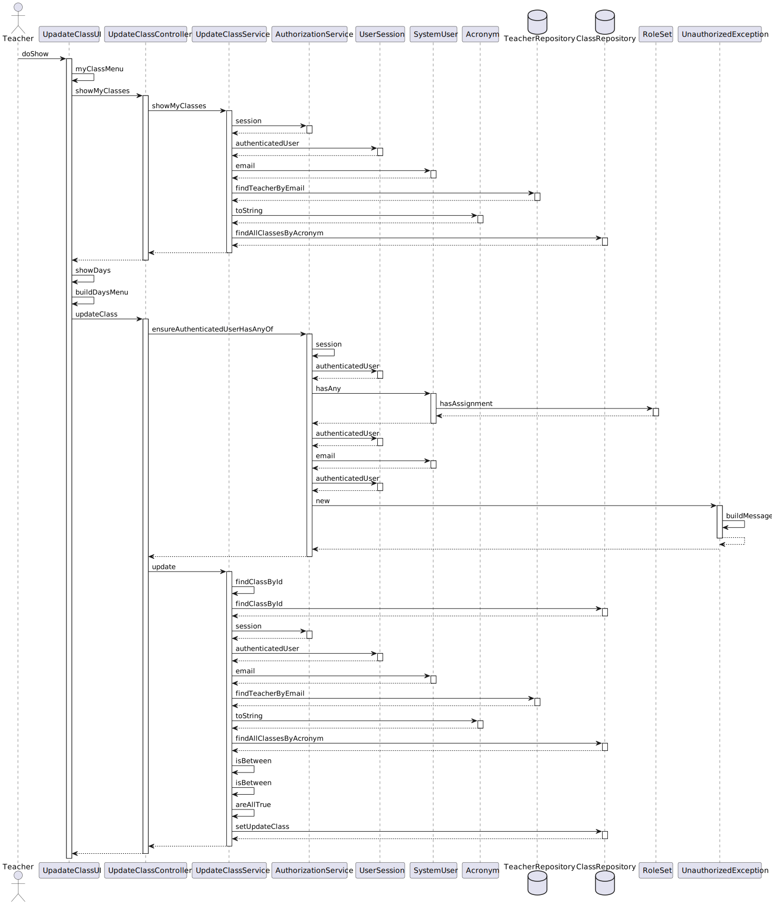
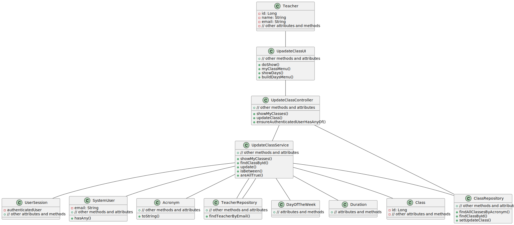

# US1012 - Update the schedule of a class

## 1. Requirements Engineering

### 1.1. User Story Description

As Teacher, I want to update the schedule of a class.

### 1.2. Customer Specifications and Clarifications

**From the specifications document:**

> - **FRC11 - Update Schedule of Class -** A teacher changes the time of a specific class (only
    changes a specific occurrence of a recurring class).

**From the client clarifications:**

n/a
### 1.3. Acceptance Criteria

- n/a

### 1.4. Found out Dependencies

* "US1010: As Teacher, I want to schedule a class."

### 1.5 Input and Output Data

**Input Data:**

* Typed data:
    * Class ID
    * New Initial Time for the Class
    * New Finish Time for the Class
    * New Day of the Week for the Class

* Selected data:
    * Class ID
    * Class Initial Time
    * Class Finish Time
    * Class Day of the Week

**Output Data:**

* UI
    * Class updated by the Teacher
* File
    * n/a

### 1.7 Other Relevant Remarks

* n/a

## 2. OO Analysis

### 2.1. Relevant Domain Model Excerpt

### 2.2. Other Remarks

n/a

## 3.2. Sequence Diagram (SD)

## 3.3. Class Diagram (CD)

## 3.4. Use Case Diagram (UCD)

