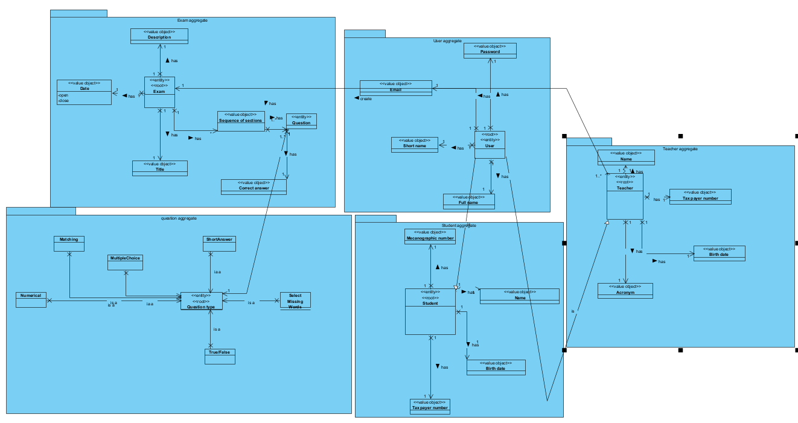
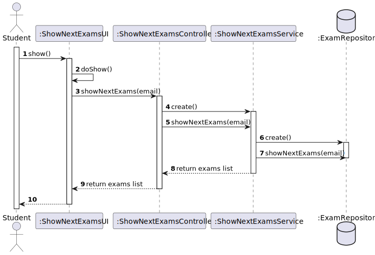
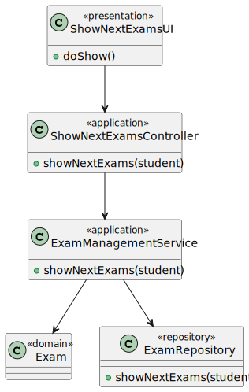

# US 2002

## 1. Context

**US2002** - As Student, I want to view a list of my future exams.

This a task assigned to a user associated with a role student and makes it able to get his next exams.

## 2. Requirements

### 2.1 Customer Specifications and Clarifications

**From the specification document:**

> - FRE02 - List Exams The system displays to a student his/her future exams.


**From the client clarifications:**

> - n/a

### 2.2 Acceptance Criteria

> - n/a

### 2.3 Found Out Dependencies
* "US1002: As Manager, I want to create courses."
* "US1003: As Manager, I want to open and close enrollments in courses."
* "US1004: As Manager, I want to open and close courses."
* "US1008: As Student, I want to request my enrollment in a course."
* "US1009: As Manager, I want to approve or reject students applications to courses."
* "US2001: As Teacher, I want to create/update an exam."


### 2.4 Input and Output Data
**Input Data:**

* Typed data:
  * Student Login

* Selected data:
  * Option to List All Exams


**Output Data:**

* UI
  * List of All Exams
* File
  * n/a


## 3. Analysis

### 3.1 Domain Excerpt


## 4. Design

### 4.1. Sequence Diagram



### 4.2. Class Diagram



### 4.3. Applied Patterns

The applied patterns are:
- Service;
- Controller;
- Repository;
- Domain.

### 4.4. Tests

## 5. Implementation

## NextExamsController.java
```
      public Iterable<Exam> nextExams(Student student){
        return examsSvc.nextExams(student);
    }


```

## 6. Integration/Demonstration

*In this section the team should describe the efforts realized in order to integrate this functionality with the other parts/components of the system*

*It is also important to explain any scripts or instructions required to execute an demonstrate this functionality*

## 7. Observations

*This section should be used to include any content that does not fit any of the previous sections.*

*The team should present here, for instance, a critical prespective on the developed work including the analysis of alternative solutioons or related works*

*The team should include in this section statements/references regarding third party works that were used in the development this work.*