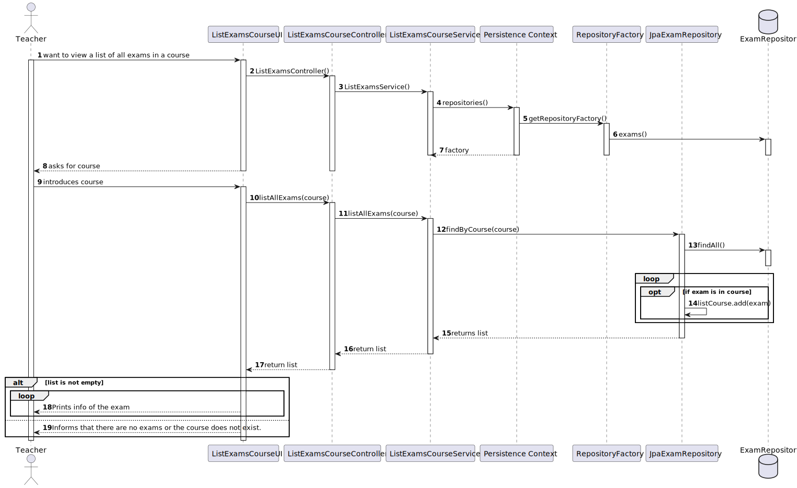
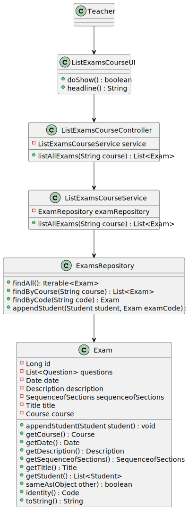

# US 2003

## 1. Context

This is a new task to do and is an important one.

## 2. Requirements

**US_2003** As Teacher, I want to view a list of all exams in a course

## 3. Analysis

### 3.1 Domain Excerpt


## 4. Design

### 4.1. Sequence Diagram



### 4.2. Class Diagram



### 4.3. Applied Patterns
The applied patterns are:
- Service;
- Controller;
- Repository;
- Domain.

## 5. Implementation

## ListExamsCourseController.java
```
        ListExamsCourseService service = new ListExamsCourseService();

        public List<Exam> listAllExams(String course){ return service.listAllExams(course); }
```


## 6. Integration/Demonstration

*In this section the team should describe the efforts realized in order to integrate this functionality with the other parts/components of the system*

*It is also important to explain any scripts or instructions required to execute an demonstrate this functionality*

## 7. Observations

*This section should be used to include any content that does not fit any of the previous sections.*

*The team should present here, for instance, a critical prespective on the developed work including the analysis of alternative solutioons or related works*

*The team should include in this section statements/references regarding third party works that were used in the development this work.*