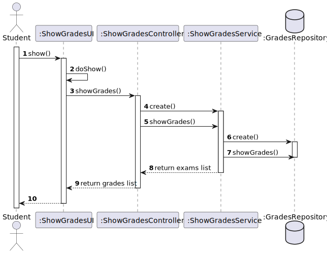
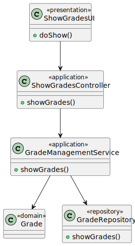

# US 2005

## 1. Context

**US2005** - As Student, I want to view a list of my grades.

This a task assigned to a user associated with a role student and makes it able for him to view a list of his/her grades.

## 2. Requirements

### 2.1 Customer Specifications and Clarifications

**From the specification document:**

> - FRE05 - List Grades The system displays to a students his/her grades.
> - "(...)  students should be able to take these exams and automatically have
    feedback and resulting grades after submitting them."

**From the client clarifications:**

> - n/a

### 2.2 Acceptance Criteria

> - n/a

### 2.3 Found Out Dependencies


### 2.4 Input and Output Data
**Input Data:**

* Typed data:
    * Student login and number of option to show his/her grades.

* Selected data:
    * n/a


**Output Data:**

* UI
    * Student grades.
* File
    * n/a


## 3. Analysis

### 3.1 Domain Excerpt


## 4. Design

### 4.1. Sequence Diagram



### 4.2. Class Diagram



### 4.3. Applied Patterns

The applied patterns are:
- Service;
- Controller;
- Repository;
- Domain.

### 4.4. Tests

## 5. Implementation

## DeactivateActivateUserController.java
```
      public Iterable<Exam> listGrades(Student student){
        return gradesService.showGrades(student);
    }
    public List<Evaluation> findById(Long code){
        return evaluationRepository.findById(code);
    }

```

## 6. Integration/Demonstration

*In this section the team should describe the efforts realized in order to integrate this functionality with the other parts/components of the system*

*It is also important to explain any scripts or instructions required to execute an demonstrate this functionality*

## 7. Observations

*This section should be used to include any content that does not fit any of the previous sections.*

*The team should present here, for instance, a critical prespective on the developed work including the analysis of alternative solutioons or related works*

*The team should include in this section statements/references regarding third party works that were used in the development this work.*