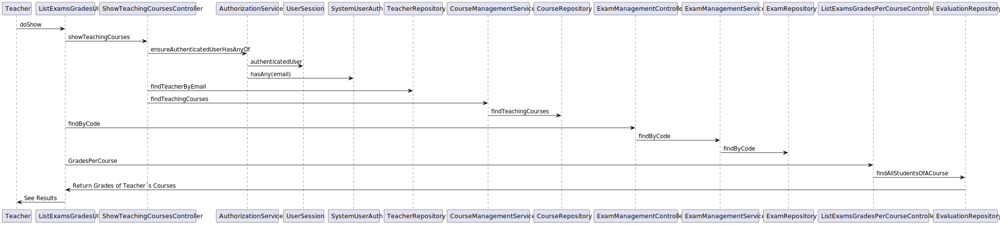
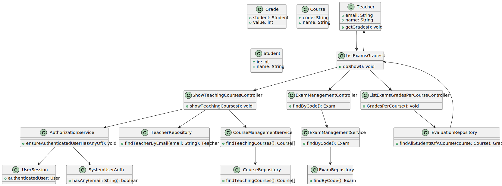

# US2006 - View a list of the grades of exams of my courses

## 1. Requirements Engineering

### 1.1. User Story Description

As Teacher, I want to view a list of the grades of exams of my courses

### 1.2. Customer Specifications and Clarifications

**From the specifications document:**

> - **FRC06 - Bulk Enroll Students in Course -** This can be made by importing a csv file
    with students. Only managers are able to execute this functionality.

    

### 1.3. Acceptance Criteria

- n/a

### 1.4. Found out Dependencies

* "US2001: As Teacher, I want to create/update an exam."

### 1.5 Input and Output Data

**Input Data:**

* Typed data:
    * n/a

* Selected data:
    * n/a

**Output Data:**

* UI
    * Display Grades Per Course of each Teacher
* File
    * n/a

### 1.7 Other Relevant Remarks

* n/a

## 2. OO Analysis

### 2.1. Relevant Domain Model Excerpt

### 2.2. Other Remarks

n/a

## 3.2. Sequence Diagram (SD)

## 3.3. Class Diagram (CD)

## 3.4. Use Case Diagram (UCD)
