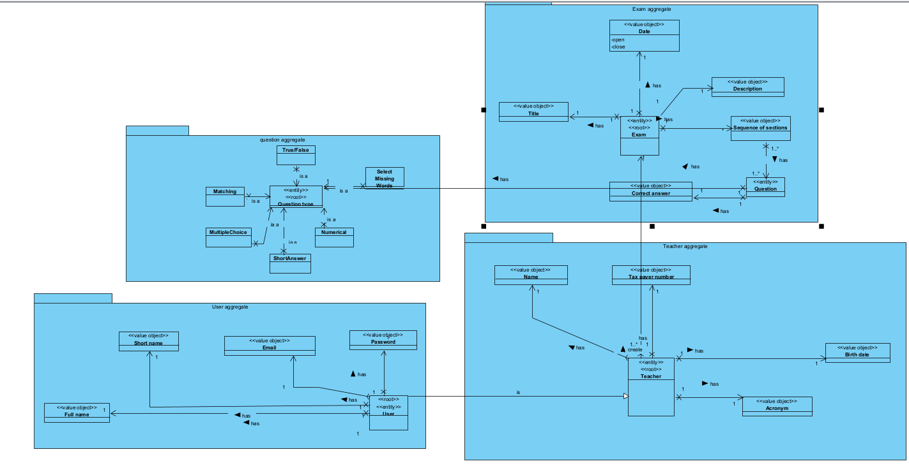
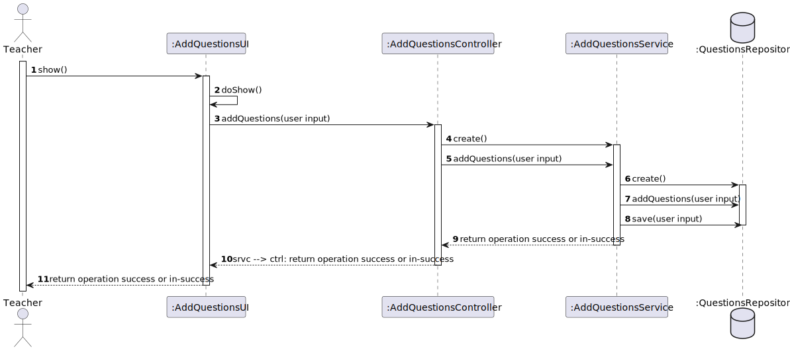
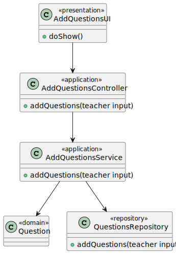

# US 2007

## 1. Context

**US2007** - As Teacher I want to add/update exam questions to a repository of exam questions to be used in automatic formative exams

This a task assigned to a user associated with a role teacher and makes it able add or update exam question to a questions' repository.

## 2. Requirements

### 2.1 Customer Specifications and Clarifications

**From the specification document:**

> - NFR01 - Programming language The solution should be implemented using Java as
    the main language. Other languages can be used in accordance with more specific requirements.
> - NFR09 - Exam Language The support for exams (its design, feedback and grading)
    must follow specific technical requirements, specified in LPROG. The ANTLR tool should
    be used (https://www.antlr.org/).

**From the client clarifications:**

> - n/a

### 2.2 Acceptance Criteria

> - This includes only the specification of single questions to be used only in automatic formative exams, not on regular exams.
    The support for exams (its design, feedback and grading) must follow specific technical requirements, specified in LPROG.
    The ANTLR tool should be used (https://www.antlr.org/).

### 2.3 Found Out Dependencies


### 2.4 Input and Output Data
**Input Data:**

* Typed data:
    * Option to create questions
    * Questions

* Selected data:
    * Option to create questions


**Output Data:**

* UI
    * Success/In-success message
* File
    * n/a


## 3. Analysis

### 3.1 Domain Excerpt


## 4. Design

### 4.1. Sequence Diagram



### 4.2. Class Diagram



### 4.3. Applied Patterns

The applied patterns are:
- Service;
- Controller;
- Repository;
- Domain.

### 4.4. Tests

## 5. Implementation

## DeactivateActivateUserController.java
```


```

## 6. Integration/Demonstration

*In this section the team should describe the efforts realized in order to integrate this functionality with the other parts/components of the system*

*It is also important to explain any scripts or instructions required to execute an demonstrate this functionality*

## 7. Observations

*This section should be used to include any content that does not fit any of the previous sections.*

*The team should present here, for instance, a critical prespective on the developed work including the analysis of alternative solutioons or related works*

*The team should include in this section statements/references regarding third party works that were used in the development this work.*