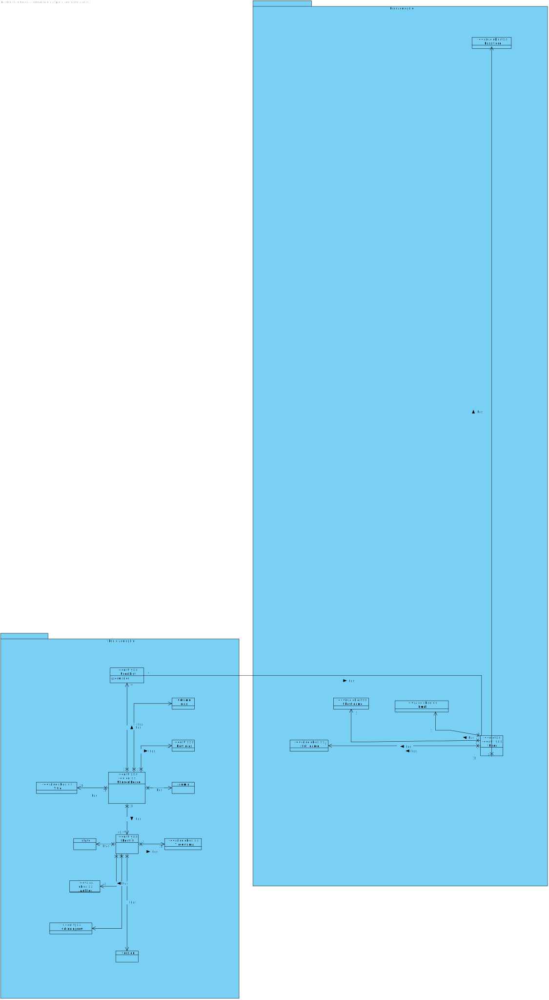
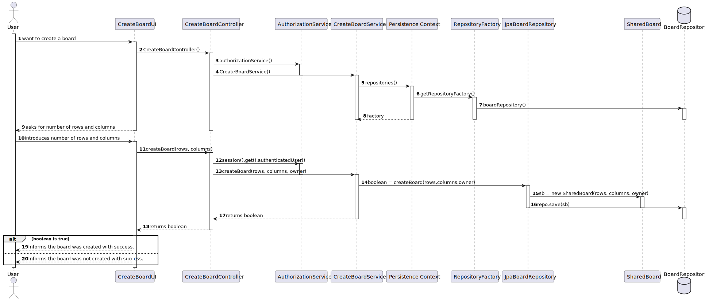
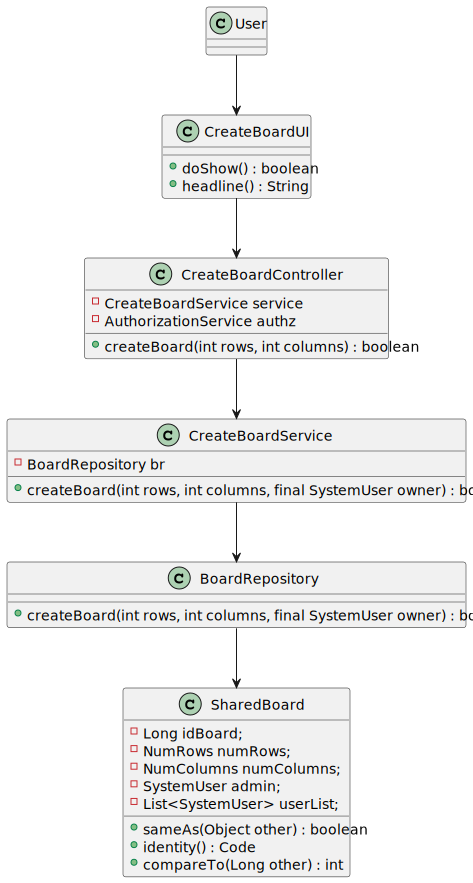

# US 3002

## 1. Context

This is a new task to do and is an important one.

## 2. Requirements

**US_3002** As User, I want to create a board

## 3. Analysis

### 3.1 Domain Excerpt


## 4. Design

### 4.1. Sequence Diagram



### 4.2. Class Diagram



### 4.3. Applied Patterns
The applied patterns are:
- Service;
- Controller;
- Repository;
- Domain.

### 4.4. Tests
**Test1** *Verifies that 2 boards are different*
```
    @Test
    void ensureSharedBoardAreDifferent() {
        SharedBoard a = createSharedBoard();
        SharedBoard b = createSharedBoard2();
        assertFalse(a.equals(b));
        assertNotSame(a, b);

        NumRows nr1 = new NumRows(10);
        NumRows nr2 = new NumRows(12);
        assertFalse(nr1.equals(nr2));
        assertNotSame(nr1, nr2);
        NumColumns nc1 = new NumColumns(10);
        NumColumns nc2 = new NumColumns(10);
        assertFalse(nc1.equals(nc2));
        assertNotSame(nc1, nc2);
    }
```
**Test2** *Verifies that a board has the same instance*
```
    @Test
    void ensureSharedBoardEqualsAreSameForSameInstance() {
        SharedBoard a = createSharedBoard();
        assertTrue(a.equals(a));
        NumRows nr1 = new NumRows(10);
        assertTrue(nr1.equals(nr1));
        NumColumns nc1 = new NumColumns(10);
        assertTrue(nc1.equals(nc1));
    }
```

## 5. Implementation

## CreateBoardController.java
```
    private CreateBoardService service;
    private final AuthorizationService authz = AuthzRegistry.authorizationService();

    public CreateBoardController(){
        service = new CreateBoardService();
    }

    public boolean createBoard(int rows, int columns) {
        final SystemUser owner = authz.session().get().authenticatedUser();
        return service.createBoard(rows, columns, owner);
    }
```


## 6. Integration/Demonstration

*In this section the team should describe the efforts realized in order to integrate this functionality with the other parts/components of the system*

*It is also important to explain any scripts or instructions required to execute an demonstrate this functionality*

## 7. Observations

*This section should be used to include any content that does not fit any of the previous sections.*

*The team should present here, for instance, a critical prespective on the developed work including the analysis of alternative solutioons or related works*

*The team should include in this section statements/references regarding third party works that were used in the development this work.*