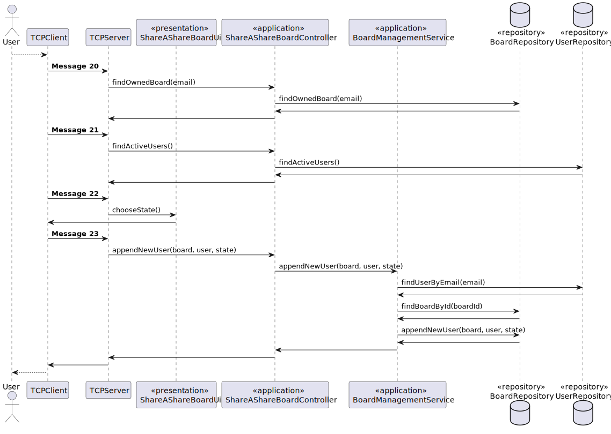

# US 3004

## 1. Context

**US3004** - As User, I want to share a board.

This a task assigned to a user associated with a role user and makes it able for him share a board.

## 2. Requirements

### 2.1 Customer Specifications and Clarifications

**From the specification document:**

> - FRB02 - Share Board A user shares a board it owns with other users
> - NFR13 - Design and Implement Shared Board Synchronization This functional
    part of the system has very specic technical requirements, particularly some concerns
    about synchronization problems. In fact, several clients will try to concurrently update
    boards. As such, the solution design and implementation must be based on threads,
    condition variables and mutexes. Specic requirements will be provided in SCOMP.


**From the client clarifications:**
> - Question: Dear client,

As I read all the requirements within these User Stories, I had a few questions:


-Who can see the board's updates?

--All users associated to a board are able to see the updates;

--All users with Write permissions in a board are able tto see its updates;

--Only the owner of a board is able to see its updates.


-As I'm sharing the board, I have to do which of these?
--give permissions to the users to Write on it immediately

--only share it with Read permissions and afterwards have the possibility to give the user write permissions

--only share it with Read permissions and lock those permissions as Read

-After sharing the board with someone, should it be considered an update to be listed on User Story 3005?

Best regards,

Pedro Alves
> - Answer: Hello.

I think that you can find the answers to the majority of your questions in the specification document.

"The user that creates the board is its owner. The owner can share the board with other users. Users may have read or write access to the board.". If a user shares the board with other users (either read or write) these users should be able to see the updates (otherwise what are we sharing?). Only users with write permissions are able to update the board.

When a user shares a board he/she must specify the users and, for each user, if the access is read or write. I think it makes sense to notify current users of a board when some update is done regarding access to the board.

Regards.


### 2.2 Acceptance Criteria

> - This functional part of the system has very specific technical requirements, particularly some concerns about synchronization problems.
    In fact, several clients will try to concurrently update boards.
    As such, the solution design and implementation must be based on threads, condition variables and mutexes. Specific requirements will be provided in SCOMP.

### 2.3 Found Out Dependencies


### 2.4 Input and Output Data
**Input Data:**

* Typed data:
    * Student login and number of option to show his/her grades.

* Selected data:
    * n/a


**Output Data:**

* UI
    * Student grades.
* File
    * n/a


## 3. Analysis

### 3.1 Domain Excerpt


## 4. Design

### 4.1. Sequence Diagram



### 4.2. Class Diagram


### 4.3. Applied Patterns

The applied patterns are:
- Service;
- Controller;
- Repository;
- Domain.

### 4.4. Tests

## 5. Implementation

## ShareAShareBoardController.java
```
    public String activeUsers() {
        String list = "";
        for (SystemUserAuth sh : repoU.findByActive(true)){
            list += sh.email().toString()+":";
        }
        return list;
    }
      public String findBoardOwned(String email){
        String list = "";
        for (SharedBoard sh : repoB.findBoardOwned(email)){
            list += sh.getIdBoard().toString()+":";
        }
        return list;
    }
    
      public boolean appendNewUser(String user, String state, String sharedBoard){
        if (boardSvc.appendNewUser(user, state, sharedBoard)) {
            return true;
        }
        return false;
    }

```

## 6. Integration/Demonstration

*In this section the team should describe the efforts realized in order to integrate this functionality with the other parts/components of the system*

*It is also important to explain any scripts or instructions required to execute an demonstrate this functionality*

## 7. Observations

*This section should be used to include any content that does not fit any of the previous sections.*

*The team should present here, for instance, a critical prespective on the developed work including the analysis of alternative solutioons or related works*

*The team should include in this section statements/references regarding third party works that were used in the development this work.*