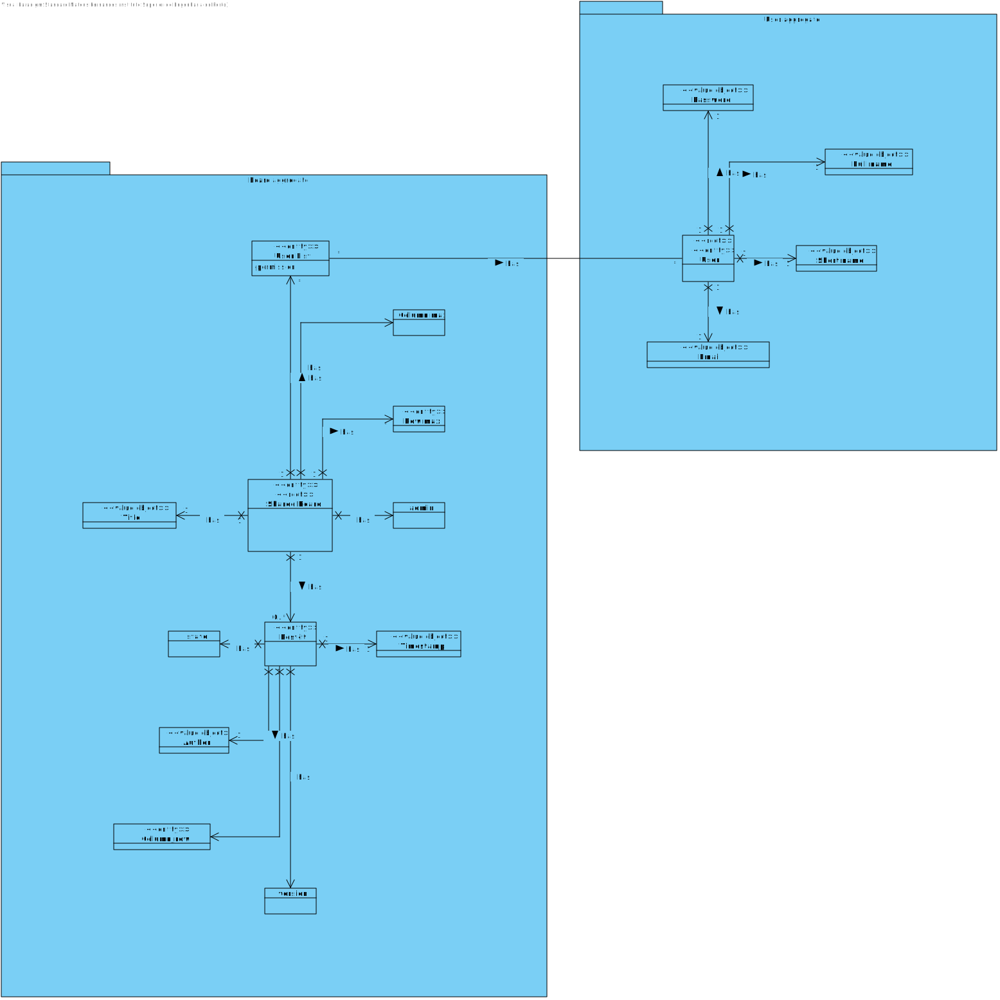
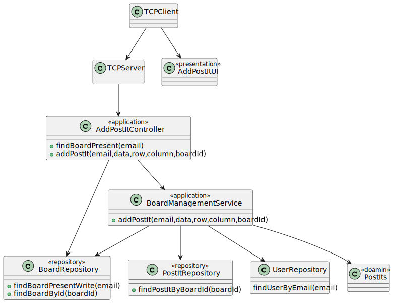

# US 3006

## 1. Context

**US3006** As User, I want to create a post-it on a board

This a task assigned to any user associated to a board and makes it able for this user to add a post-it to a board where the user has write permissions.

## 2. Requirements

### 2.1 Customer Specifications and Clarifications

**From the specification document:**

>- FRB04 -  **Create Post-it** A user creates a post-it on a board
>- NFR13 -  **Design and Implement Shared Board Synchronization** This functional
   part of the system has very specific technical requirements, particularly some concerns
   about synchronization problems. In fact, several clients will try to concurrently update
   boards. As such, the solution design and implementation must be based on threads,
   condition variables and mutexes. Specific requirements will be provided in SCOMP.


**From the client clarifications:**

-N/A

### 2.2 Acceptance Criteria

-N/A

### 2.3 Found Out Dependencies

**US3002** As User, I want to create a board

**US3004** As User, I want to share a board

A user must have permissions to write in a sharedboard and must be present in at least one. The board needs to exist already in a database. The user can be the owner or it can enter through the owner's invite.

### 2.4 Input and Output Data

**Input Data:**

* Typed data:
    *  Server Login
    *  Data of post-it
    *  Row of post-it
    *  Column of post-it

* Selected data:
    * Menu option to add a post-it
    * Board to add the post-it

**Output Data:**

* Post-it added with success in case of success
* It is not possible to add a post-it to the board in case of failure

## 3. Analysis

### 3.1 Domain Excerpt


## 4. Design

### 4.1. Sequence Diagram


### 4.2. Class Diagram




### 4.3. Applied Patterns

The applied patterns are:
- Service;
- Controller;
- Repository;
- Domain.

### 4.4. Tests


## 5. Implementation

## AddPostItController.java
```
        return svc.addPostIt(email,data,row,column,boardId);
```
```
        String list = "";
        for (SharedBoard sh : repoB.findBoardPresentWrite(email)){
            list += sh.getIdBoard().toString()+":";
        }
        return list;
```

## BoardManagementService.java
```
        final SystemUserAuth author = repoU.findUserByEmail(email);
        SharedBoard board = repoB.findBoardById(Long.valueOf(boardId.replaceAll("[^a-zA-Z0-9@:.\n]", "")));
        boolean sameRowColumn = false;
        synchronized (board.getIdBoard()) {
            try {
                //String name = Console.readLine("Works?");
                int row = Integer.parseInt(rowS);
                int column = Integer.parseInt(columnS);
                for (PostIts p : repoP.findPostItByBoardId(board.getIdBoard())) {
                    if (row == p.numRows().numRows() && column == p.numColumns().numColumns()) {
                        sameRowColumn = true;
                        break;
                    }
                }
                if (row > board.numRows().numRows() || column > board.numColumns().numColumns() || sameRowColumn) {
                    throw new Exception();
                }
                PostIts post = new PostIts(1, new NumRows(row), new NumColumns(column), author, data, board);
                repoP.save(post);
                return true;
            } catch (Exception e) {
                return false;
            }
        }
```


## 6. Integration/Demonstration

## 7. Observations

*The user can only add a post-it in an empty cell or if the row and column inputed are lower than the database number of rows and columns. It this requirements are not met, an exception will be thrown and the user has to start the process again*