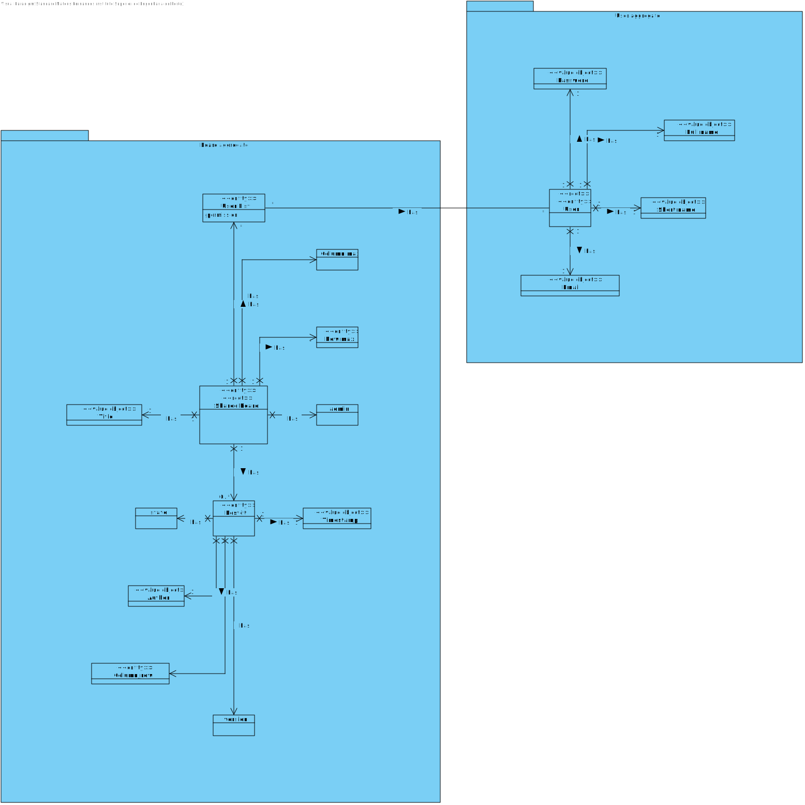
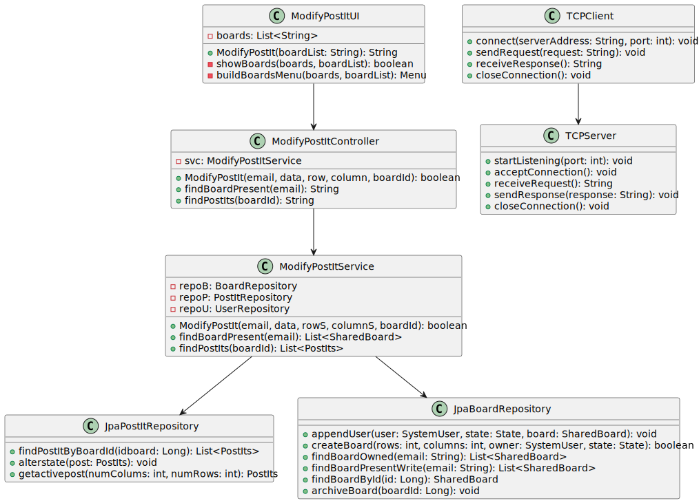

# US3007

## 1. Requirements Engineering


### 1.1. User Story Description


As User, I want to change a post-it

### 1.2. Customer Specifications and Clarifications


**From the specifications document:**

> - FRB05 - Change Post-it A user changes a post-it

> - NFR13 - Design and Implement Shared Board Synchronization This functional part of the system has very specific technical requirements, particularly some concerns about synchronization problems. In fact, several clients will try to concurrently update boards. As such, the solution design and implementation must be based on threads, condition variables and mutexes. Specific requirements will be provided in SCOMP.


**From the client clarifications:**

- n/a

### 1.3. Acceptance Criteria

- This functional part of the system has very specific technical requirements, particularly some concerns about synchronization problems.


### 1.4. Found out Dependencies


* " US 3006: As User, I want to create a post-it on a board "


### 1.5 Input and Output Data


**Input Data:**

* Typed data:
    * Row and Column
    * data to change

* Selected data:
    * Board


**Output Data:**

* UI
    * Information that the post it was changed successfully


## 2. OO Analysis

### 2.1. Relevant Domain Model Excerpt



### 2.2. Other Remarks

n/a


## 3. Design - User Story Realization

### 3.1. Rationale

### Systematization ##

According to the taken rationale, the conceptual classes promoted to software classes are:

* 

Other software classes (i.e. Pure Fabrication) identified:

* 


## 3.2. Sequence Diagram (SD)


## 3.3. Class Diagram (CD)




### 4.4. Tests
**Test1** **
```

```
**Test2** **
```

```

## 5. Implementation

### ModifyPostItUI.java
```
package eapli.base.app.sharedboardapp.sharedboard;

import eapli.framework.actions.menu.Menu;
import eapli.framework.actions.menu.MenuItem;
import eapli.framework.io.util.Console;
import eapli.framework.presentation.console.menu.MenuItemRenderer;
import eapli.framework.presentation.console.menu.MenuRenderer;
import eapli.framework.presentation.console.menu.VerticalMenuRenderer;

import java.util.ArrayList;
import java.util.List;

/**
 * The type Modify post it ui.
 *
 * @author joaomorais
 */
public class ModifyPostItUI {


    /**
     * Modify post it string.
     *
     * @param boardList the board list
     * @return the string
     */
    public String ModifyPostIt(String boardList) {
        String result;
        final List<String> boards = new ArrayList<>();
        boolean show;
        do {
            show = showBoards(boards,boardList);
        } while (!show);
        final String data = Console.readLine("Post-It data (Text or image path):");
        final String row = Console.readLine("Row:");
        final String column = Console.readLine("Column:");
        result = data+"::"+row+"::"+column+"::"+boards.get(0);
        return result;

    }


    private boolean showBoards(final List<String> boards,final String boardList) {
        final Menu boardsMenu = buildBoardsMenu(boards,boardList);
        final MenuRenderer renderer = new VerticalMenuRenderer(boardsMenu, MenuItemRenderer.DEFAULT);
        return renderer.render();
    }

    private Menu buildBoardsMenu(final List<String> boards,String boardList) {
        final Menu rolesMenu = new Menu();
        int counter = 1;
        String[] list = boardList.split(":");
        for (int i = 0; i< list.length; i++){
            int finalI = i;
            rolesMenu.addItem(MenuItem.of(counter++, list[i], () -> boards.add(list[finalI])));
        }
        return rolesMenu;
    }
}

```

### ModifyPostItController.java
```
package eapli.base.app.sharedboard;

import eapli.base.BoardManagement.domain.PostIts;
import eapli.base.BoardManagement.domain.SharedBoard;

/**
 * The type Modify post it controller.
 *
 * @author joaomorais
 */
public class ModifyPostItController {

    private final ModifyPostItService svc = new ModifyPostItService();

    /**
     * Modify post it boolean.
     *
     * @param email   the email
     * @param data    the data
     * @param row     the row
     * @param column  the column
     * @param boardId the board id
     * @return the boolean
     */
    public boolean ModifyPostIt (String email,String data, String row,String column, String boardId){
        return svc.ModifyPostIt(email,data,row,column,boardId);
    }


    /**
     * Find board present string.
     *
     * @param email the email
     * @return the string
     */
    public String findBoardPresent(String email){
        String list = "";
        for (SharedBoard sh : svc.findBoardPresent(email)){
            list += sh.getIdBoard().toString()+":";
        }
        return list;
    }


    /**
     * Find post its string.
     *
     * @param boardId the board id
     * @return the string
     */
    public String findPostIts(Long boardId){
        String list = "";
        for (PostIts pst : svc.findPostIts(boardId)){
            list += pst.toString()+":";
        }
        return list;
    }

}

```

### ModifyPostItService.java
```
package eapli.base.app.sharedboard;

import domain.model.SystemUser;
import domain.repositories.UserRepository;
import eapli.base.BoardManagement.domain.NumColumns;
import eapli.base.BoardManagement.domain.NumRows;
import eapli.base.BoardManagement.domain.PostIts;
import eapli.base.BoardManagement.domain.SharedBoard;
import eapli.base.BoardManagement.repositories.BoardRepository;
import eapli.base.BoardManagement.repositories.PostItRepository;
import eapli.base.infrastructure.persistence.PersistenceContext;

import java.util.List;

/**
 * The type Modify post it service.
 *
 * @author joaomorais
 */
public class ModifyPostItService {

    private final BoardRepository repoB = PersistenceContext.repositories().boardRepository();
    private final PostItRepository repoP = PersistenceContext.repositories().postItRepository();

    private final UserRepository repoU = PersistenceContext.repositories().users();


    /**
     * Modify post it boolean.
     *
     * @param email   the email
     * @param data    the data
     * @param rowS    the row s
     * @param columnS the column s
     * @param boardId the board id
     * @return the boolean
     */
    public boolean ModifyPostIt(String email,String data, String rowS,String columnS, String boardId){
        final SystemUser author = repoU.findUserByEmail(email);
        SharedBoard board = repoB.findBoardById(Long.valueOf(boardId.replaceAll("[^a-zA-Z0-9@:.\n]", "")));
        int row = Integer.parseInt(rowS);
        int column = Integer.parseInt(columnS);

        PostIts previousPost = repoP.getactivepost(column,row);
        double newversion = previousPost.version();
        newversion++;

        PostIts post = new PostIts(newversion, new NumRows(row),new NumColumns(column),author,data,board);

        repoP.alterstate(previousPost);
        repoP.save(post);

        return  true;
    }


    /**
     * Find board present list.
     *
     * @param email the email
     * @return the list
     */
    public List<SharedBoard> findBoardPresent(String email){
        return repoB.findBoardPresentWrite(email);
    }

    /**
     * Find post its list.
     *
     * @param bordId the bord id
     * @return the list
     */
    public List<PostIts> findPostIts(Long bordId){
        return repoP.findPostItByBoardId(bordId);
    }


}

```

