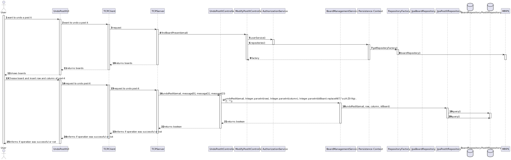
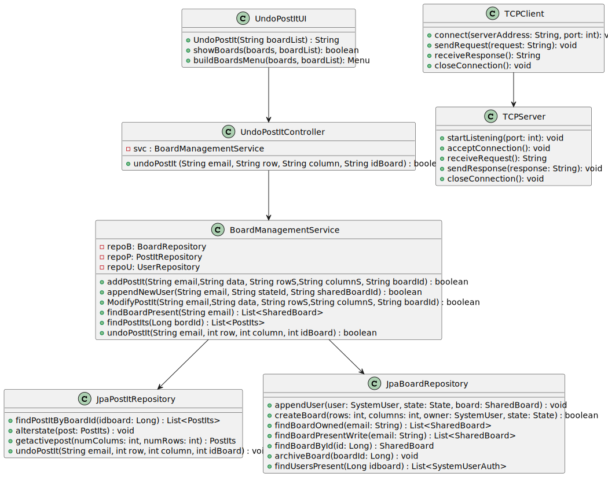

# US 3008

## 1. Context

**US_3008** As User, I want to undo the last change in a post-it

## 2. Requirements

## 2.1 Customer Specifications and Clarifications

> - NFR13 - Design and Implement Shared Board Synchronization This functional part of the system has very specific technical requirements, particularly some concerns about synchronization problems. In fact, several clients will try to concurrently update boards. As such, the solution design and implementation must be based on threads, condition variables and mutexes. Specific requirements will be provided in SCOMP.
> 
>**Question:** Any user can undo de post-it or only the user who created it ?
>
>**Answer:** Only the user who created it
> 
### 2.2 Acceptance Criteria

- N/A

### 2.3 Found Out Dependencies

### 2.4 Input and Output Data

**Input Data:**

* Typed data:
    * User Login
    * Row and Column of post-it to undo

* Selected data:
    * Shared Board with post-it to undo

**Output Data:**
    * Says the post-it was undone or an error has occurred.

## 3. Analysis

### 3.1 Domain Excerpt


## 4. Design

### 4.1. Sequence Diagram



### 4.2. Class Diagram



### 4.3. Applied Patterns

The applied patterns are:
- TCPServer
- TCPClient
- Service;
- Controller;
- Repository;
- Domain.

### 4.4. Tests

**Test1** *Verifies that is not possible to create a null NumColumns*
```
    @Test
    void numColumns() {
        Assertions.assertThrows(NumberFormatException.class, () -> {
            new NumColumns(Integer.parseInt(""));
        });
    }
```

**Test2** *Verifies that is not possible to create a null NumRows*
```
    @Test
    void numRows() {
        Assertions.assertThrows(NumberFormatException.class, () -> {
            new NumRows(Integer.parseInt(""));
        });
    }
```

**Test3** *Tests all the getters in PostIts*
```
    @Test
    void getters() {
        SharedBoard b = createSharedBoard();
        PostIts a = createPostIt(b);

        assertEquals(a.version(), 1, 0.00001);
        assertEquals(a.numColumns().numColumns(), 2);
        assertEquals(a.numRows().numRows(), 2);
        assertEquals(a.sharedBoard(), b);
        assertEquals(a.data(), "aaaaa");
    }
```

**Test4** *Tests all the setters in PostIts*
```
    @Test
    void setters() {
        SharedBoard b = createSharedBoard();
        PostIts a = createPostIt(b);

        assertEquals(a.version(), 1, 0.00001);
        a.changeVersion(2);
        assertEquals(a.version(), 2, 0.00001);
    }
```

**Test5** *Tests all the getters in ShareBoard*
```
    @Test
    void getters() {
        SharedBoard a = createSharedBoard();

        assertEquals(a.numColumns().numColumns(), 10);
        assertEquals(a.numRows().numRows(), 10);
        assertEquals(a.admin().email().toString(), "dummy@gmail.com");
    }
```

## 5. Implementation

## UndoPostItController.java

```
    private final BoardManagementService svc = new BoardManagementService();

    public UndoPostItController() {
    }

    public synchronized boolean undoPostIt (String email, String row, String column, String idBoard){
        return svc.undoPostIt(email, Integer.parseInt(row), Integer.parseInt(column), Integer.parseInt(idBoard.replaceAll("[^a-zA-Z0-9@:.\n]", "")));
    }

```

## 6. Integration/Demonstration

## 7. Observations