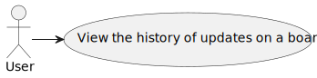

# US3009 - View the history of updates on a board

## 1. Requirements Engineering

### 1.1. User Story Description

As User, I want to view the history of updates on a board

### 1.2. Customer Specifications and Clarifications

**From the specifications document:**

> - **FRC07 - View Board History -** A user views a history of updates in a board
> - **NFR13 - Design and Implement Shared Board Synchronization-** This functional
    part of the system has very specific technical requirements, particularly some concerns
    about synchronization problems. In fact, several clients will try to concurrently update
    boards. As such, the solution design and implementation must be based on threads,
    condition variables and mutexes. Specific requirements will be provided in SCOMP.

    

### 1.3. Acceptance Criteria

- This functional part of the system has very specific technical requirements, particularly some concerns about synchronization problems.
  In fact, several clients will try to concurrently update boards.
  As such, the solution design and implementation must be based on threads, condition variables and mutexes. Specific requirements will be provided in SCOMP.

### 1.4. Found out Dependencies

* "US3004: As User, I want to share a board"
* "US3006: As User, I want to create a post-it on a board"
* "US3007: As User, I want to change a post-it"

### 1.5 Input and Output Data

**Input Data:**

* Typed data:
    * n/a

* Selected data:
    * n/a

**Output Data:**

* UI
    * Shared Board History
* File
    * n/a

### 1.7 Other Relevant Remarks

* n/a

## 2. OO Analysis

### 2.1. Relevant Domain Model Excerpt

### 2.2. Other Remarks

n/a

## 3.2. Sequence Diagram (SD)

## 3.3. Class Diagram (CD)

## 3.4. Use Case Diagram (UCD)
