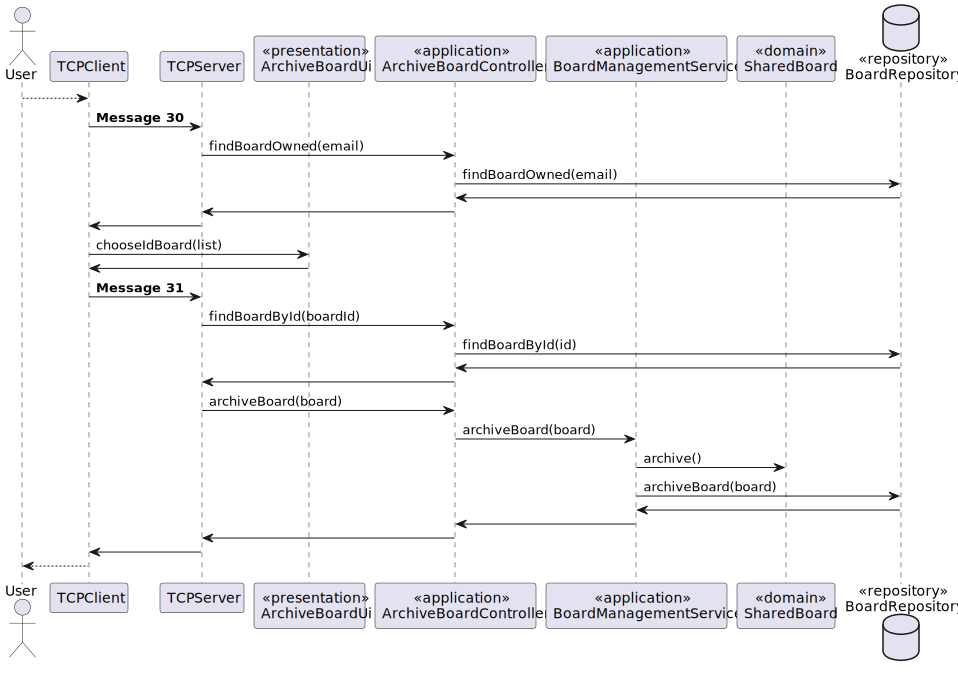
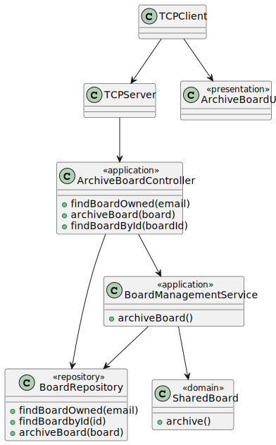

# US 3010

## 1. Context

**US3010** As User, I want to archive a board I own

This a task assigned only to the owner of the board and makes it able for this user to archive a board.

## 2. Requirements

### 2.1 Customer Specifications and Clarifications

**From the specification document:**

>- FRB08 -  **Archive Board** The owner of a board can archive the board
>- NFR13 -  **Design and Implement Shared Board Synchronization** This functional
   part of the system has very specific technical requirements, particularly some concerns
   about synchronization problems. In fact, several clients will try to concurrently update
   boards. As such, the solution design and implementation must be based on threads,
   condition variables and mutexes. Specific requirements will be provided in SCOMP.


**From the client clarifications:**

-N/A

### 2.2 Acceptance Criteria

-N/A

### 2.3 Found Out Dependencies

**US3002** As User, I want to create a board

A user must have a board create by him in order to archive.

### 2.4 Input and Output Data

**Input Data:**

* Typed data:
  *  Server Login

* Selected data:
  * Menu option to archive a board
  * Board to that will be archived

**Output Data:**

* Board was archived with success in case of success
* Can't archive a board that is already archived in case of failure

## 3. Analysis

### 3.1 Domain Excerpt


## 4. Design

### 4.1. Sequence Diagram



### 4.2. Class Diagram




### 4.3. Applied Patterns

The applied patterns are:
- Service;
- Controller;
- Repository;
- Domain.

### 4.4. Tests


## 5. Implementation

## ArchiveBoardController.java
```
        return svc.archiveBoard(board);
```
```
        String list = "";
        for (SharedBoard sh : boardRepository.findBoardOwned(email)){
            list += sh.getIdBoard().toString()+":";
        }
        return list;
```
```
        return boardRepository.findBoardById(id);
```

## BoardManagementService.java
```
        synchronized (board.getIdBoard()) {
            try {
                board.archive();
                repoB.archiveBoard(board);
                return true;
            } catch (Exception e) {
                return false;
            }
        }
```


## 6. Integration/Demonstration

## 7. Observations

*The user can only archive a board that has the condition archived as false. If this requirements are not met, an exception will be thrown and the user has to start the process again*