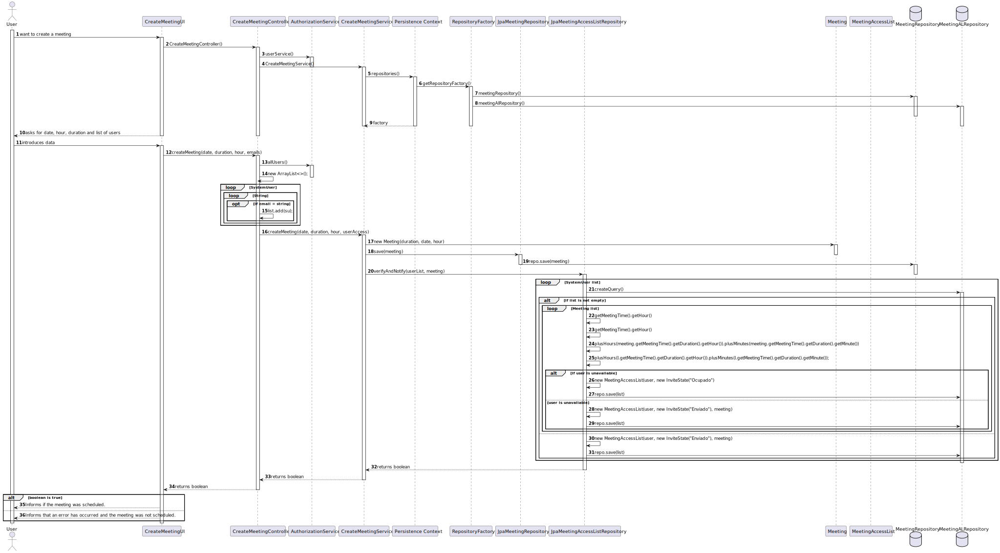
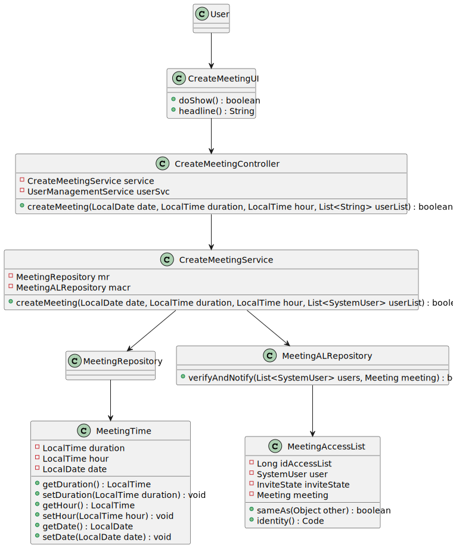

# US 4001

## 1. Context

This is a new task to do and is an important one.

## 2. Requirements

**US_4001** As User, I want to schedule a meeting

## 3. Analysis

### 3.1 Domain Excerpt


## 4. Design

### 4.1. Sequence Diagram



### 4.2. Class Diagram



### 4.3. Applied Patterns
The applied patterns are:
- Service;
- Controller;
- Repository;
- Domain.

### 4.4. Tests
**Test1** *Tests the invite state*
```
    @Test
    void testInviteState() {
        InviteState a = new InviteState("Sent");
        assertEquals(a.getInviteState(), "Sent");
        a.setInviteState("Occupied");
        assertEquals(a.getInviteState(), "Occupied");
    }
```
**Test2** *Checks if 2 meetings are different*
```
    @Test
    void ensureMeetingsAreDifferent() {
        MeetingAccessList a = createMal();
        MeetingAccessList b = createMal2();
        assertFalse(a.equals(b));
        assertNotSame(a, b);
    }
```
**Test3** *Checks if a meeting has the same instance*
```
    @Test
    void ensureMeetingsEqualsAreSameForSameInstance() {
        MeetingAccessList a = createMal();
        assertTrue(a.equals(a));
    }
```

**Test4** *Checks if 2 meeting times are different*
```
    @Test
    void ensureMeetingTimesAreDifferent() {
        MeetingTime a = createMeetingTime();
        MeetingTime b = createMeetingTime2();
        Meeting c = new Meeting(a);
        Meeting d = new Meeting(b);
        assertFalse(a.equals(b));
        assertNotSame(a, b);

        assertFalse(c.equals(d));
        assertNotSame(c, d);
    }
```
**Test5** *Checks if a meeting time has the same instance*
```
    @Test
    void ensureMeetingTimesEqualsAreSameForSameInstance() {
        MeetingTime a = createMeetingTime();
        Meeting c = new Meeting(a);
        assertTrue(a.equals(a));
        assertTrue(c.equals(c));
    }
```
**Test6** *Checks getters and setters*
```
    @Test
    void ensureMeetingTimesGettersReturnExpectedValues() {
        LocalTime duration = LocalTime.of(1,29,0,0);
        LocalTime hour = LocalTime.of(12,29,0,0);
        LocalDate date = LocalDate.of(2022,03,05);
        MeetingTime a = new MeetingTime(duration,hour,date);
        MeetingTime b = createMeetingTime();
        Meeting c = new Meeting(a);
        Meeting d = new Meeting(b);

        assertEquals(a.getDate(), b.getDate());
        assertEquals(a.getDuration(), b.getDuration());
        assertEquals(a.getHour(), b.getHour());
        assertEquals(c.getMeetingTime().getHour(), d.getMeetingTime().getHour());
        assertEquals(c.getMeetingTime().getDuration(), d.getMeetingTime().getDuration());
        assertEquals(c.getMeetingTime().getDate(), d.getMeetingTime().getDate());
    }
```

## 5. Implementation

## CreateMeetingController.java
```
    private CreateMeetingService service;
    private final UserManagementService userSvc = AuthzRegistry.userService();

    public CreateMeetingController(){
        service = new CreateMeetingService();
    }

    public boolean createMeeting(LocalDate date, LocalTime duration, LocalTime hour, List<String> userList) {
        Iterable<SystemUser> allUsers = userSvc.allUsers();
        List<SystemUser> userAccess = new ArrayList<>();
        for(SystemUser su : allUsers){
            for(String ul : userList){
                if(su.email().toString().equals(ul)){
                    userAccess.add(su);
                }
            }
        }
        return service.createMeeting(date, duration, hour, userAccess);
    }
```

## 6. Integration/Demonstration

*In this section the team should describe the efforts realized in order to integrate this functionality with the other parts/components of the system*

*It is also important to explain any scripts or instructions required to execute an demonstrate this functionality*

## 7. Observations

*This section should be used to include any content that does not fit any of the previous sections.*

*The team should present here, for instance, a critical prespective on the developed work including the analysis of alternative solutioons or related works*

*The team should include in this section statements/references regarding third party works that were used in the development this work.*