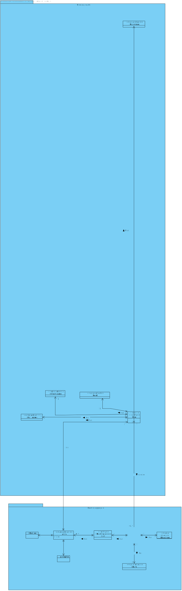
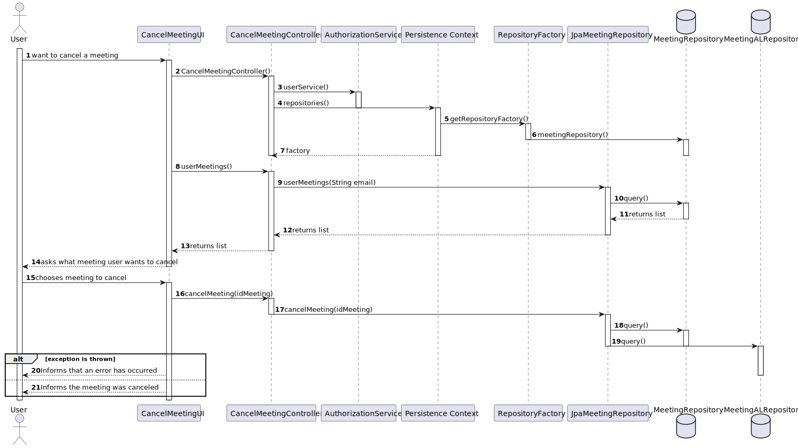
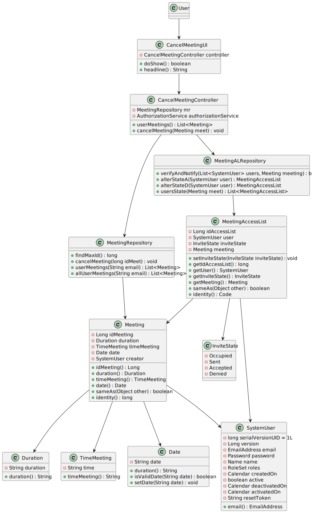

# US 4002

## 1. Context

**US_4002** As User, I want to cancel a meeting

## 2. Requirements

## 2.1 Customer Specifications and Clarifications

### 2.2 Acceptance Criteria

- N/A

### 2.3 Found Out Dependencies

### 2.4 Input and Output Data

**Input Data:**

* Typed data:
    * User Login

* Selected data:
    * Option to cancel the meeting
    * Meeting to cancel

**Output Data:**
    * Informs if the meeting was canceled or not (in case of an error)

## 3. Analysis

### 3.1 Domain Excerpt


## 4. Design

### 4.1. Sequence Diagram



### 4.2. Class Diagram



### 4.3. Applied Patterns

The applied patterns are:
- Service;
- Controller;
- Repository;
- Domain.

### 4.4. Tests

**Test1** *Verifies that it's not possible to insert invalid formats into the duration of the meeting*
```
    @Test
    void duration() {
        Duration a = new Duration("10:30");
        assertEquals(a.duration(), "10:30");
    }

    @Test
    public void ensureDurationCantBeNullOrEmpty(){
        Assertions.assertThrows(IllegalArgumentException.class, () -> {
            new Duration(null);
        });
        Assertions.assertThrows(IllegalArgumentException.class, () -> {
            new Duration("");
        });
    }

    @Test
    public void ensureDurationCantBeWrongFormat(){
        Assertions.assertThrows(IllegalArgumentException.class, () -> {
            new Duration("100:30");
        });
        Assertions.assertThrows(IllegalArgumentException.class, () -> {
            new Duration("10h30m");
        });
    }
```

**Test2** *Tests all getters are functioning properly*
```
    @Test
    void getters() {
        Duration duration = new Duration("01:30");
        TimeMeeting timeMeeting = new TimeMeeting("11:30");
        Date date = new Date("2023-05-06");
        Meeting a = new Meeting(1l, duration, timeMeeting, date, getNewDummyUser());
        assertEquals(1l, a.idMeeting().longValue());
        assertEquals(a.duration(), duration);
        assertEquals(a.timeMeeting(), timeMeeting);
        assertEquals(a.date(), date);

    }
```

**Test3** *Tests all getters and setters are functioning properly*
```
    @Test
    void getters() {
        MeetingAccessList a = createMal();
        assertEquals(1l, a.meeting().idMeeting().longValue());
        assertEquals(a.user().email().toString(), "dummy@gmail.com");
        assertEquals(a.inviteState(), InviteState.Sent);
    }

    @Test
    void setters() {
        MeetingAccessList a = createMal();
        a.setInviteState(InviteState.Accepted);
        assertEquals(a.inviteState(), InviteState.Accepted);
    }
```

**Test4** *Verifies that it's not possible to insert invalid formats into the time of the meeting*
```
    @Test
    void timeMeeting() {
        TimeMeeting a = new TimeMeeting("10:30");
        assertEquals(a.timeMeeting(), "10:30");
    }

    @Test
    public void ensureTimeMeetingCantBeNullOrEmpty(){
        Assertions.assertThrows(IllegalArgumentException.class, () -> {
            new TimeMeeting(null);
        });
        Assertions.assertThrows(IllegalArgumentException.class, () -> {
            new TimeMeeting("");
        });
    }

    @Test
    public void ensureTimeMeetingCantBeWrongFormat(){
        Assertions.assertThrows(IllegalArgumentException.class, () -> {
            new TimeMeeting("100:30");
        });
        Assertions.assertThrows(IllegalArgumentException.class, () -> {
            new TimeMeeting("10h30m");
        });
    }
```


## 5. Implementation

## CancelMeetingController.java

```
    public class CancelMeetingController {
        MeetingRepository mr = PersistenceContext.repositories().meetingRepository();
        private final AuthorizationService authorizationService;
    
        public CancelMeetingController(){
            authorizationService = AuthzRegistry.authorizationService();
        }
    
        public List<Meeting> userMeetings(){
            return mr.userMeetings(authorizationService.session().get().authenticatedUser().email().toString());
        }
    
        public void cancelMeeting(Meeting meet) {
            mr.cancelMeeting(meet.idMeeting());
        }
    }
```

## 6. Integration/Demonstration

## 7. Observations