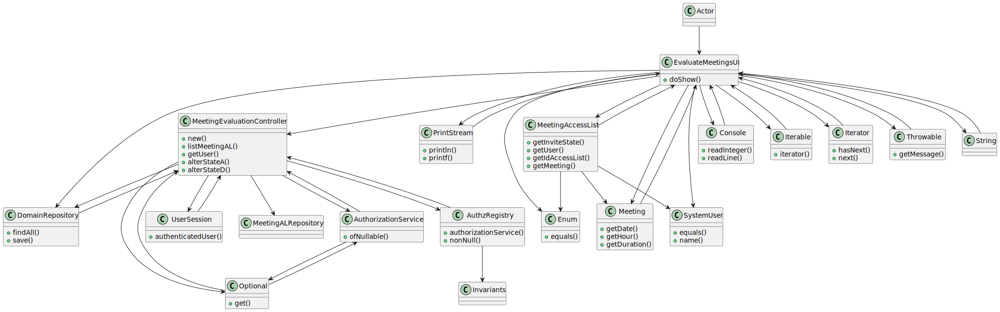

# US4003 - Meeting Request

## 1. Requirements Engineering


### 1.1. User Story Description


As User, I want to accept or reject a meeting request.

### 1.2. Customer Specifications and Clarifications


**From the specifications document:**

> - FRM03 - Accept/Reject Meeting A user accepts or rejects an invitation to a meeting


**From the client clarifications:**


> **Question:** "Em relação a esta US deveríamos simplesmente considerar os "meeting request" que não foram aceites ou rejeitados?
Um "meeting request" que já foi aceite ou rejeitado poderá ser alterado, depois?
Obrigado pela atenção"

> **Answer:**
> Não sei se discutiu o assunto na aula OT presencial, mas a intenção nesta US é fazer exactamente o que está descrito: aceitar ou rejeitar um pedido de reunião. A decisão é tomada uma única vez pelo utilizador.


### 1.3. Acceptance Criteria

- n/a


### 1.4. Found out Dependencies

* "US4001: As User, I want to schedule a meeting."

### 1.5 Input and Output Data


**Input Data:**

* Typed data:
    * Number of the meeting on the list 

* Selected data:
    * Meeting


**Output Data:**

* UI
    * Information that the request was accepted or denied


## 2. OO Analysis

### 2.1. Relevant Domain Model Excerpt


### 2.2. Other Remarks

n/a


## 3. Design - User Story Realization

### 3.1. Rationale

### Systematization ##

According to the taken rationale, the conceptual classes promoted to software classes are:

* 

Other software classes (i.e. Pure Fabrication) identified:

* 


## 3.2. Sequence Diagram (SD)


## 3.3. Class Diagram (CD)



### 4.4. Tests
**Test1** **
```

```
**Test2** **
```

```

## 5. Implementation

## MeetingEvaluationController.java
```
package eapli.base.MeetingManagement.application;

import application.AuthorizationService;
import application.AuthzRegistry;
import domain.model.SystemUser;
import eapli.base.MeetingManagement.domain.MeetingAccessList;
import eapli.base.MeetingManagement.repositories.MeetingALRepository;
import eapli.base.infrastructure.persistence.PersistenceContext;

public class MeetingEvaluationController {


    MeetingALRepository meetingaccesslistRepository = PersistenceContext.repositories().meetingAlRepository();

    private final AuthorizationService authorizationService;


    public MeetingEvaluationController() {
        authorizationService = AuthzRegistry.authorizationService();
    }


    public SystemUser getUser(){

        SystemUser user  = authorizationService.session().get().authenticatedUser();

        return user;
    }

    public Iterable<MeetingAccessList> listMeetingAL() {
        return meetingaccesslistRepository.findAll();
    }

    public MeetingAccessList alterStateA(SystemUser user) {return meetingaccesslistRepository.alterStateA(user);}

    public MeetingAccessList alterStateD(SystemUser user) {return meetingaccesslistRepository.alterStateD(user);}


}


```

